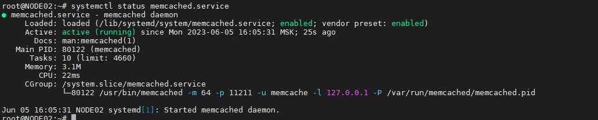
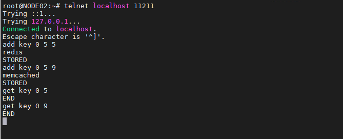
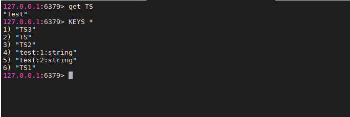
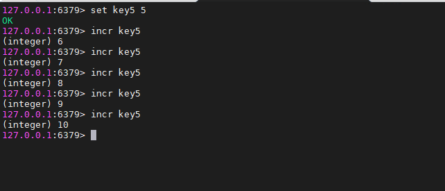

### Задание 1. Кеширование
Приведите примеры проблем, которые может решить кеширование.

*Приведите ответ в свободной форме.*  

### Ответ:  

* Запросы к базам данных могут быть медленными и требовать серьёзных системных ресурсов, так как серверу баз данных, для формирования ответа, нужно выполнять некие   вычисления. Если запросы повторяются, кэширование их средствами базы данных поможет уменьшить время её отклика. Кроме того, кэширование полезно в ситуациях, когда   несколько компьютеров работают с базой данных, выполняя одинаковые запросы.
* Сглаживание бустов трафика. Например, во время глобальной распродажи онлайн-магазины используют кэш, чтобы переживать резкое увеличение трафика.

---

### Задание 2. Memcached

Установите и запустите memcached.

*Приведите скриншот systemctl status memcached, где будет видно, что memcached запущен.*  

### Ответ:

  

---

### Задание 3. Удаление по TTL в Memcached

Запишите в memcached несколько ключей с любыми именами и значениями, для которых выставлен TTL 5.

*Приведите скриншот, на котором видно, что спустя 5 секунд ключи удалились из базы.*  

### Ответ:  

  

---

### Задание 4. Запись данных в Redis

Запишите в Redis несколько ключей с любыми именами и значениями.

*Через redis-cli достаньте все записанные ключи и значения из базы, приведите скриншот этой операции.*  

### Ответ:  

  

---

### Задание 5*. Работа с числами

Запишите в Redis ключ key5 со значением типа "int" равным числу 5. Увеличьте его на 5, чтобы в итоге в значении лежало число 10.

*Приведите скриншот, где будут проделаны все операции и будет видно, что значение key5 стало равно 10.*  

### Ответ:  

  
