### Задание 1

На лекции рассматривались режимы репликации master-slave, master-master, опишите их различия.

*Ответить в свободной форме.*

### Ответ:  

* Master-Slave репликация - выделяется один основной сервер базы данных. На нем происходят все изменения в данных (любые запросы MySQL INSERT/UPDATE/DELETE). Slave сервер постоянно копирует все изменения с master. С приложения на slave отправляются запросы чтения данных (запросы SELECT). Таким образом master отвечает за изменения данных, а slave за чтение.
* Master-Master - это настройка обычной Master-Slave репликации, только в обе стороны (каждый сервер является мастером и слейвом одновременно)

---

### Задание 2

Выполните конфигурацию master-slave репликации, примером можно пользоваться из лекции.

*Приложите скриншоты конфигурации, выполнения работы: состояния и режимы работы серверов.*  

### Ответ:  

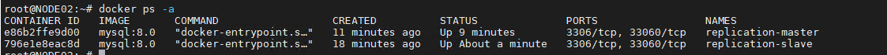  
  
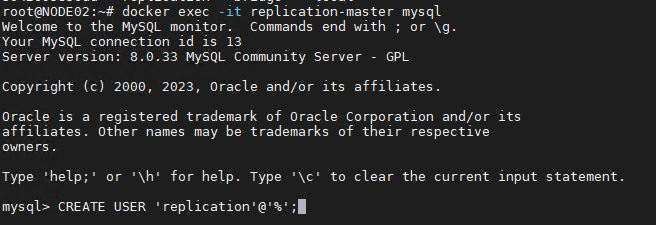  
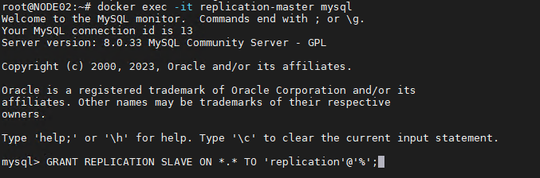  
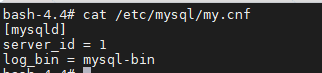  
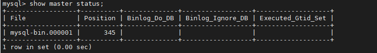  
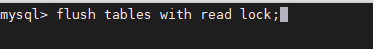  
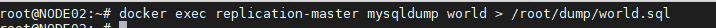  
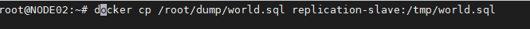  
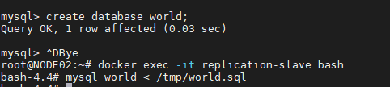  
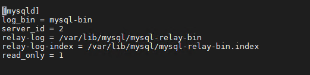  
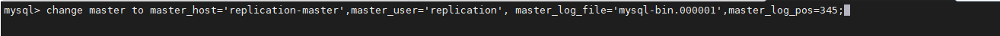  
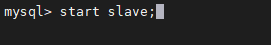  
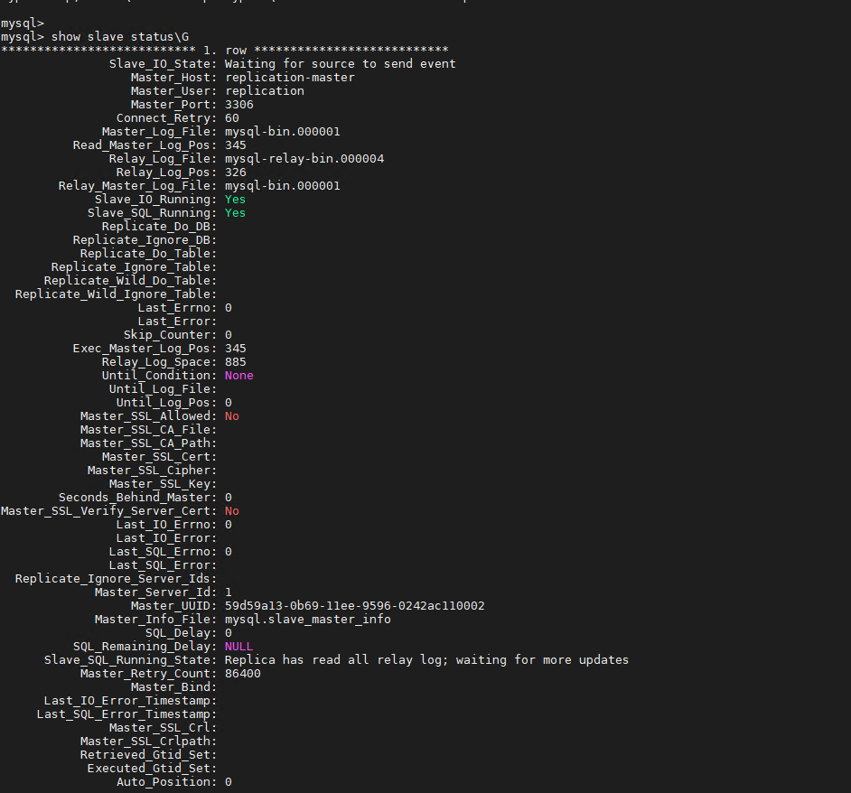  