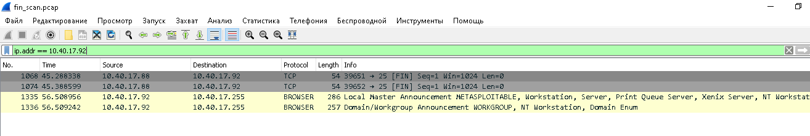
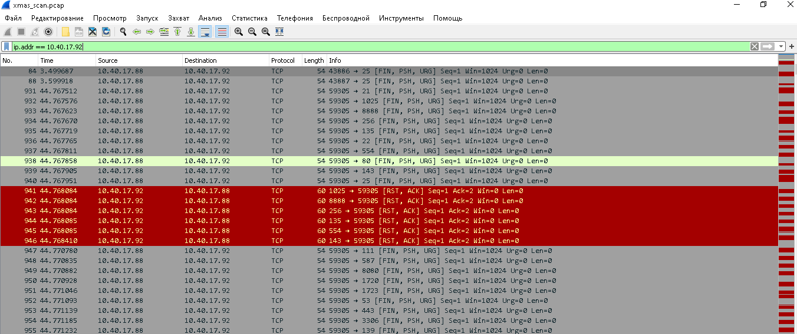
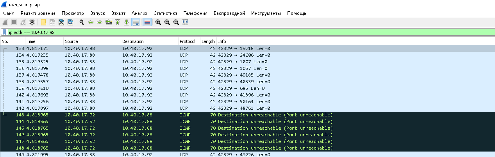

### Задание 1
Скачайте и установите виртуальную машину Metasploitable: https://sourceforge.net/projects/metasploitable/.

Это типовая ОС для экспериментов в области информационной безопасности, с которой следует начать при анализе уязвимостей.

Просканируйте эту виртуальную машину, используя nmap.

Попробуйте найти уязвимости, которым подвержена эта виртуальная машина.

Сами уязвимости можно поискать на сайте https://www.exploit-db.com/.

Для этого нужно в поиске ввести название сетевой службы, обнаруженной на атакуемой машине, и выбрать подходящие по версии уязвимости.

Ответьте на следующие вопросы:

* Какие сетевые службы в ней разрешены?
* Какие уязвимости были вами обнаружены? (список со ссылками: достаточно трёх уязвимостей)  

*Приведите ответ в свободной форме.*

### Ответ
Сетевые службы:  
  
Уязвимости:  
* https://www.exploit-db.com/exploits/7701  
* https://www.exploit-db.com/exploits/40963 
* https://www.exploit-db.com/exploits/16701  

---

### Задание 2
Проведите сканирование Metasploitable в режимах SYN, FIN, Xmas, UDP.

Запишите сеансы сканирования в Wireshark.

Ответьте на следующие вопросы:

* Чем отличаются эти режимы сканирования с точки зрения сетевого трафика?
* Как отвечает сервер?

*Приведите ответ в свободной форме*

### Ответ:  

1. SYN сканирование:
Отправляется на интересующий порт запрос на синхронизацию по протоколу TCP (SYN). Если порт открыт, в ответ приходит пакет SYN-ACK. После этого сканер обрывает соединение, не завершив его установку. Если порт закрыт, приходит сообщение о разрыве соединения.

[syn_scan.pcap](syn_scan.pcap)
2. FIN сканирование:
Работает так же, как и SYN сканирование, но отправляется пакет FIN (запрос на завершение соединения).
Закрытый порт отвечает на них пакетом RST (разрыв соединения). Открытый — не отвечает.

[fin_scan.pcap](fin_scan.pcap)
3. XMAS сканирование:
"Скрытое" сканирование.  Например, после трехстороннего подтверждения TCP и успешной передачи данных обычно с сервера или из клиента отправляются пакеты FIN, чтобы прекратить подключение. При этом передается сообщение, что «больше нет доступных данных от отправителя». Пакеты FIN часто остаются незамеченными брандмауэром, так как в первую очередь отслеживаются пакеты SYN. По этой причине при XMAS-сканировании отправляются пакеты со всеми флагами, включая FIN. Отсутствие ответа будет означать, что порт открыт. Если порт закрыт, будет получен ответ RST. XMAS-сканирование редко отображается в журналах отслеживания и является более незаметным способом получить данные о защите сети и брандмауэре.

[xmas_scan.pcap](xmas_scan.pcap)
4. UDP сканирование:
UDP сканирование работает путем посылки пустого (без данных) UDP заголовка на каждый целевой порт. Если в ответ приходит ICMP ошибка о недостижимости порта (тип 3, код 3), значит порт закрыт. Другие ICMP ошибки недостижимости (тип 3, коды 1, 2, 9, 10 или 13) указывают на то, что порт фильтруется. Иногда, служба будет отвечать UDP пакетом, указывая на то, что порт открыт. Если после нескольких попыток не было получено никакого ответа, то порт классифицируется как открыт|фильтруется. Это означает, что порт может быть открыт, или, возможно, пакетный фильтр блокирует его.

[udp_scan.pcap](udp_scan.pcap)
