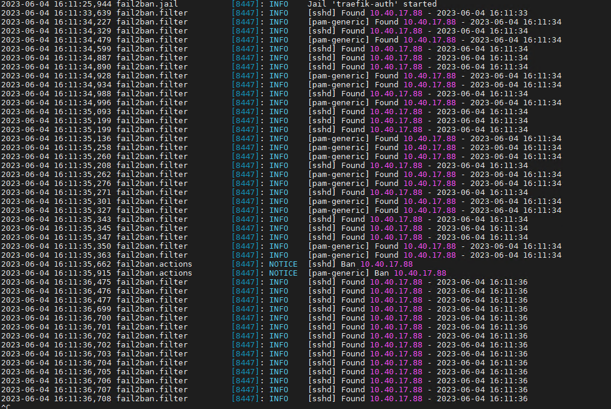

### Задание 1

Проведите разведку системы и определите, какие сетевые службы запущены на защищаемой системе:

```sudo nmap -sA < ip-адрес >```

```sudo nmap -sT < ip-адрес >```

```sudo nmap -sS < ip-адрес >```

```sudo nmap -sV < ip-адрес >```

По желанию можете поэкспериментировать с опциями: https://nmap.org/man/ru/man-briefoptions.html.

*В качестве ответа пришлите события, которые попали в логи Suricata и Fail2Ban, прокомментируйте результат.*

### Ответ: 
На защищаемой системе запущена служба ssh (OpenSSH 8.4p1 Debian 5+deb11u1 (protocol 2.0))  
В логах fail2ban нет событий, т.к с точки зрения системы не происходит ничего аномального  
Suricata увидела подозрительное поведение и сообщила об этом
  
  


---

### Задание 2

Проведите атаку на подбор пароля для службы SSH:

hydra -L users.txt -P pass.txt < ip-адрес > ssh

1. Настройка hydra:
* создайте два файла: users.txt и pass.txt;
* в каждой строчке первого файла должны быть имена пользователей, второго — пароли. В нашем случае это могут быть случайные строки, но ради эксперимента можете добавить  имя и пароль существующего пользователя.

Дополнительная информация по hydra: https://kali.tools/?p=1847.

2. Включение защиты SSH для Fail2Ban:
* открыть файл /etc/fail2ban/jail.conf,
* найти секцию ssh,
* установить enabled в true.

Дополнительная информация по Fail2Ban:https://putty.org.ru/articles/fail2ban-ssh.html.

*В качестве ответа пришлите события, которые попали в логи Suricata и Fail2Ban, прокомментируйте результат.*

### Ответ:

При атаке на подбор пароля suricata увидела подозрительное поведение и сообщила об это. Fail2ban заблокировал адрес, т.к количество попыток подбора пароля превысило   счетчик возможных попыток

  
  
