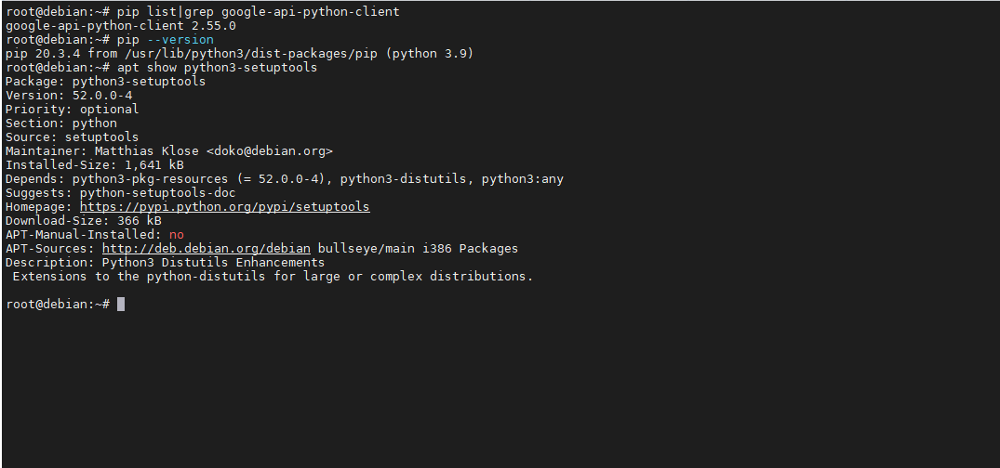
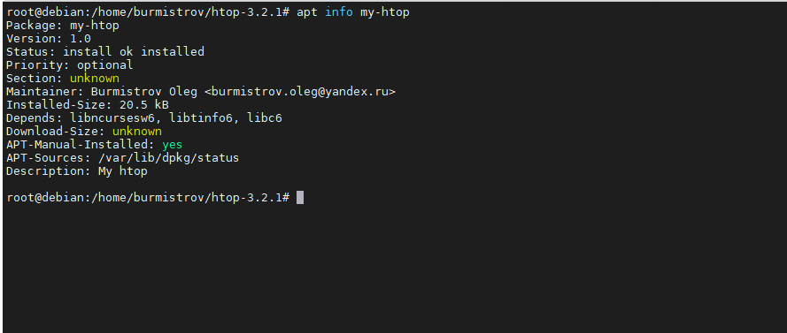

# Кейс 1.

Опишите плюсы работы с пакетным менеджером и репозиторием.
* Как вы считаете, в чем основные достоинства такой организации ПО?
* Есть ли минусы?

*Напишите ответ в свободной форме.*

# Ответ:
### Плюсы:
* Удобство установки и удаления (не требуется собирать ПО из исходников)
* Автоматическая установка зависисмостей 

### Минусы:
* Не всегда в репозиториях находится последняя версия ПО

---

# Кейс 2.

При подключении стороннего репозитория надо выполнить ряд определенных действий.
* Каких?
* В чем опасность такого способа распространения ПО?
* Как это решается?

*Напишите ответ в свободной форме.*

# Ответ:
Для подключения стороннего репозитория необходимо:

* Установить дополнительное ПО (если требуется)
* Скачать gpg ключ
* Добавить адерес репозитория в source.list (на примере менеджера APT)

Опасность такого подхода заключается в том, что можно скачать из непроверенного репозитория вредоносное ПО, а не то, 
что требуется.

Эта проблема решатся использованием gpg ключей, которыми подписываются пакеты в проверенных репозиториях.

---

# Кейс 3.
Перейдем к практике.
* Запустите свою виртуальную машину.
* Найдите в репозиториях и установите одной командой пакет htop.

Какие зависимости требует htop?

*Ответ приведите в виде текста команды, которой вы это выполнили, а также приложите скриншот места расположения
исполняемых файлов установленного ПО.*

# Ответ: 
`sudo apt search htop && sudo apt install -y htop`  

 Htop требует следующие зависисмости: 
exfalso fonts-font-awesome fonts-lato gimp-data gir1.2-gtksource-3.0 gir1.2-keybinder-3.0 libamd2 libbabl-0.1-0 libcamd2 libccolamd2 libcholmod3 libgegl-0.4-0 libgegl-common libgimp2.0 libjs-jquery
libjs-sphinxdoc libjs-underscore libmetis5 libumfpack5 python3-feedparser python3-musicbrainzngs python3-mutagen python3-pyinotify quodlibet sphinx-rtd-theme-common system-config-printer xsane
xsane-common  

---

# Кейс 4.

1. Подключите репозиторий PHP и установите PHP 8.0.

Приложите скриншот содержимого файла, в котором записан адрес репозитория.*

2. При помощи команды php -v убедитесь, что бы поставлена корректная версия PHP.

*Приложите к ответу скриншот версии.*  

# Ответ:  
  

  

---

# Кейс 5.

Ваш коллега-программист просит вас установить модуль google-api-python-client на сервер, который необходим для 
программы, работающей с Google API.

Установите данный пакет при помощи менеджера пакетов pip.

**Примечание №1**: для установки может быть необходим пакет python-distutils, проверьте его наличие в системе.

**Примечание №2**: не забудьте выдать права на исполение скачанному файлу. Возможно, будет ошибка при установки при помощи 
Python версии 2, в таком случае воспользйтесь командой python3.

*Приложите скриншоты с установленным пакетом python-distutils, с версией Pip и установленными модулями 
(должны быть видимы)*

# Ответ:  

  

---

# Кейс 6.

1. Перечислите менеджеры пакетов, кроме тех, о которых говорилось на лекции. В каких дистрибутивах они работают?
2. Есть ли альтернативные менеджеры для тех, которые разбирались на лекции?

*Напишите ответ в свободной форме.*  

# Ответ:  
1. Yast - SUSE, Portage - Gentoo, Slackpkg - Slackware
2. Для YUM, в качестве альтернативы, может быть использован APT  

---

# Кейс 7.

1. Скачайте исходники любого приложения и соберите пакет для того дистрибутива, на котором вы работаете.
2. Установите его при помощи менеджера пакетов

*Ответ приведите в виде скриншота.*  

# Ответ:  
  

