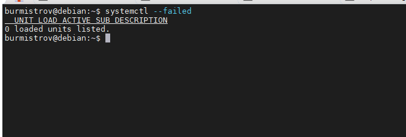

# Задание 1.

Выполните systemd-analyze blame.

*Укажите, какие модули загружаются дольше всего.*

# Ответ:  

Дольше всего загружались: man-db.service, NetworkManager-wait-online.service, plymouth-quit-wait.service, 
logrotate.service, apparmor.service, dev-sda1.device, e2scrub_reap.service, exim4-base.service, udisks2.service, 
phpsessionclean.service, apache2.service, colord.service  

---

# Задание 2.

Какой командой вы посмотрите ошибки ядра, произошедшие начиная со вчерашнего дня?

*Напишите ответ в свободной форме.*  

# Ответ:  

`journalctl -k -S 2022-08-03`  

---

# Задание 3.

Запустите команду loginctl user-status.

*Что выполняет, для чего предназначена эта утилита?*  

# Ответ: 

loginctl - Управление менеджером входа в систему. С командой user-status - показывает информацию о состоянии выполнения
для пользователя вошедшего в систему.

---

# Задание 4.

Есть ли у вас на машине службы, которые не смогли запуститься? Как вы это определили?

*Приведите ответ в свободной форме.*  

# Ответ:  

Нет, все службы запустились. О чем свидетельсвует результат выполнения команды `systemctl --failed`

---

# Задание 5.

Можно ли с помощью systemd отмонтировать раздел/устройство?

*Приведите ответ в свободной форме.*

# Ответ:  
Да, можно. Для этого служит утилита **systemd-mount**, с ключом **--umount или -u*  

