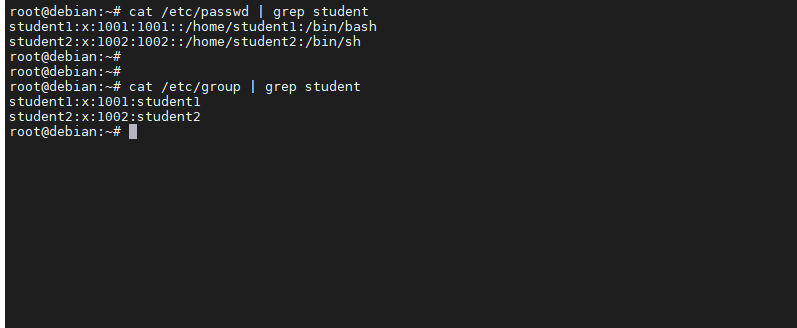

# Задание 1.

Создайте пользователя `student1` с оболочкой bash, входящего в группу `student1`.

Создайте пользователя `student2`, входящего в группу `student2`.

*Приведите ответ в виде снимков экрана.*  

# Ответ:  
  

---

# Задание 2.

Создайте в общем каталоге (например, /tmp) директорию и назначьте для неё полный доступ со стороны группы `student2` и доступ на чтение всем остальным

*Приведите ответ в виде снимков экрана.*

# Ответ:  
  

---

# Задание 3.

Какой режим доступа установлен для файлов `/etc/passwd` и `/etc/shadow`?

Объясните, зачем понадобилось именно два файла?

*Приведите ответ в свободной форме.*  

# Ответ: 
Для файла `/etc/passwd` установлен режим:**rw-r--r--** (Чтение/запись для владельца, только чтение для группы и остальных 
пользователей)  

Для файла `/etc/shadow` установлен режим: **rw-r-----** (Чтение запись для владельца, только чтение для группы)  

В `/etc/passwd` хранится список пользователей, которые известны системе.
В `/etc/shadow` хранятся записи о зашифрованных паролях пользователей, а также другая информация, связанная с паролями.  
Изначально пароли пользователей хранились в `/etc/passwd`, затем, в целях безопасности зашифрованные пароли были перенесены 
в `/etc/shadow`. Одним из основных событий, которое заставило разработчиков перенести хранение паролей в `/etc/shadow` -  это атака червя Морриса.  

---

# Задание 4.

Удалите группу `student2`, а пользователя `student2` добавьте в группу `student1`.

*Приведите ответ в виде снимков экрана.*  

# Ответ:  
  

---

# Задание 5.

Создайте в общем каталоге (например, /tmp) директорию и назначьте для неё полный доступ для всех, кроме группы `student1`.  Группа `student1` не должна иметь доступа к содержимому этого каталога.

*Приведите ответ в виде снимков экрана.*  

# Ответ:  
  
