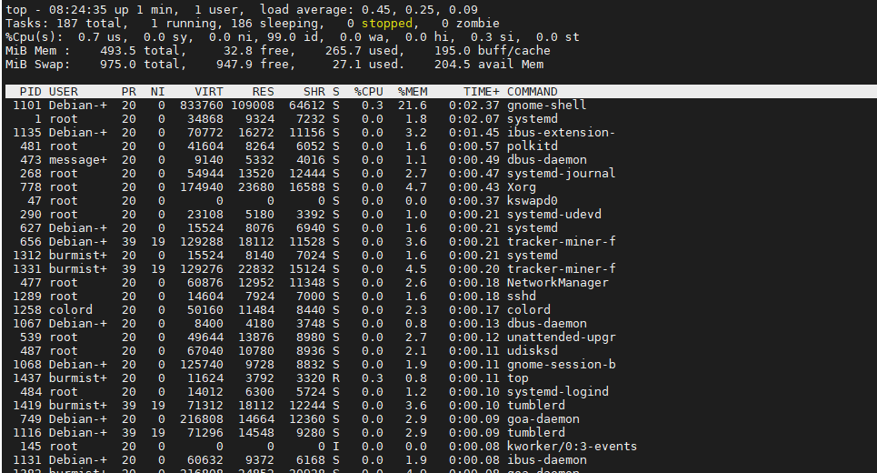
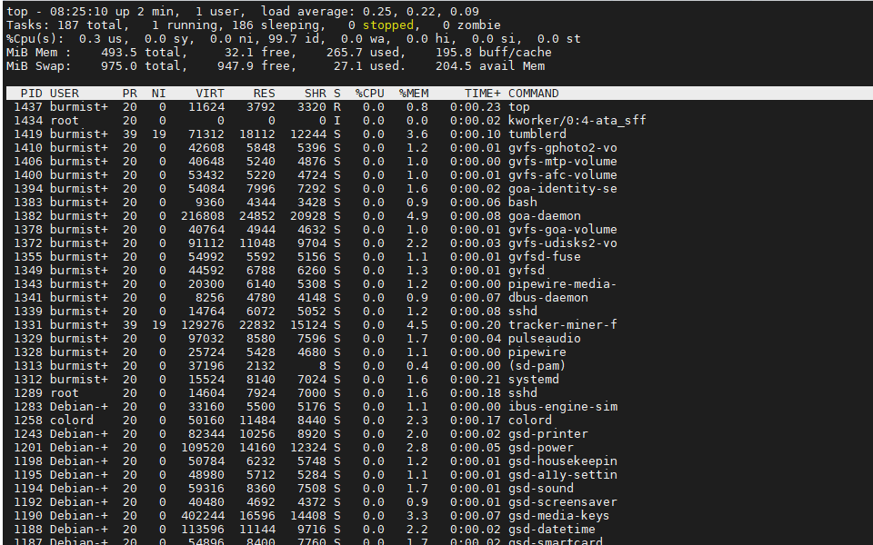
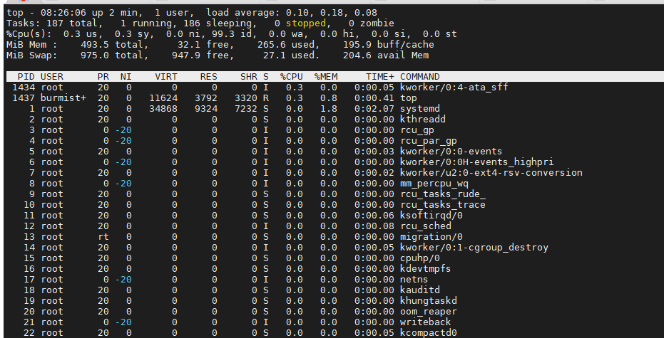

# Задание 1.

Выполните проверку системы при помощи команды `top`.

**Выведите сортировку процессов по:**

- памяти;
- времени работы;
- номеру;
- уровню потребления ресурсов.

*Приведите ответ в виде снимков экрана.*

# Ответ:  

  

  

  

---

