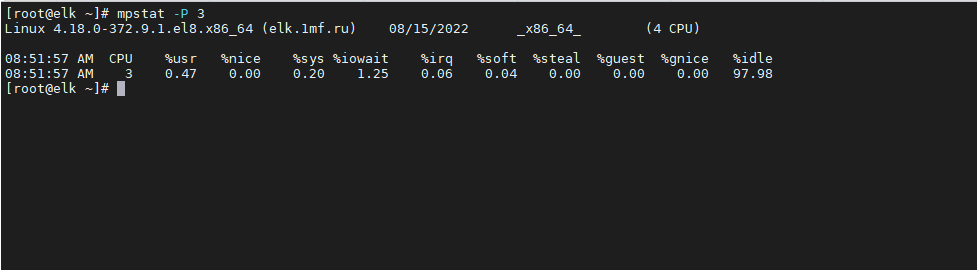
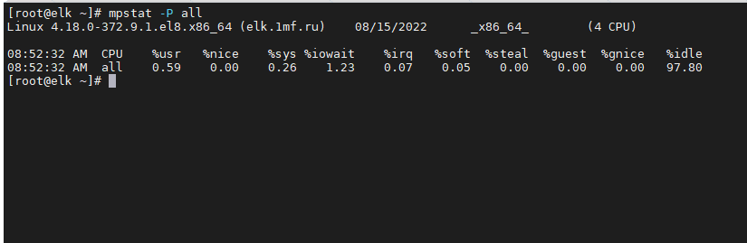

# Задание 1.

Выполните проверку системы при помощи команды `top`.

**Выведите сортировку процессов по:**

- памяти;
- времени работы;
- номеру;
- уровню потребления ресурсов.

*Приведите ответ в виде снимков экрана.*

# Ответ:  

  

  

  

---

# Задание 2.

Выполните проверку системы при помощи команды `atop` и `atopsar`.

**Выведите сортировку процессов по:**

- общей нагрузке (минимум по трем параметрам);
- загруженности HDD or SSD за указанный временной отрезок (10 минут);
- загруженности RAM за указанный временной отрезок (10 минут).

**Сконфигурировать файл настроек atop - делать снимок памяти каждые пол часа**

*Приведите ответ в виде снимков экрана.*

# Ответ:  

---  

# Задание 3.

При помощи команды `mpstat` и ключа `P` выведите информацию по:

- определённому процессору;
- всем процессорам.

*Приведите ответ в виде снимков экрана.*  

# Ответ:  
  

  
