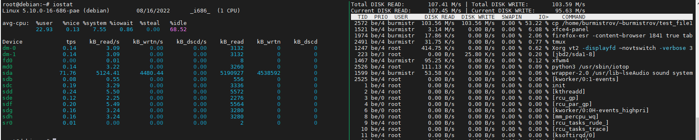
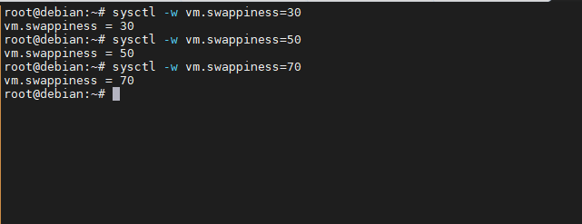

# Задание 1.
Составьте задание через утилиту cron на проверку обьема кэша-обновлений еженедельно.  

Кэш-обновлений - это обновления которые остаются после выполнения *apt update, apt upgrade*.  

*Приведите ответ в виде команды.*  

# Ответ:  
`* * */7 * * du -sh /var/cache/apt/archives > ~/cache_size`  

---

# Задание 2.

- Запустите процесс копирования большого файла (1 Гб) на жесткий диск.
- Запустите команду `iostat`.
- Запустите `iotop`.

Какие процессы влияют на данные команды?

*Проведите развернутый ответ и приложите снимки экрана.*  

# Ответ:  
На данные выводимые этими командами могут влиять любые процессы связанные с 
вводом/выводом.  

---

# Задание 3.

Настройте приоритет использования `swap` в пропорции:

- 30/70;
- 50/50;
- 70/30.

Запустите браузер и нагрузите память.

Проанализируйте результат.

*Проведите развернутый ответ и приложите снимки экрана.*  

# Ответ:  
В пропорции 70/30 запуск браузера происходит ощутимо быстрее, чем в пропорции 30/70.
Т.к в пропорции 70/30 ядро начинает сбрасывать в swap, при заполнении оперативной памяти
более чем на 70%, а swap работает медленнее чем оперативная память.  

