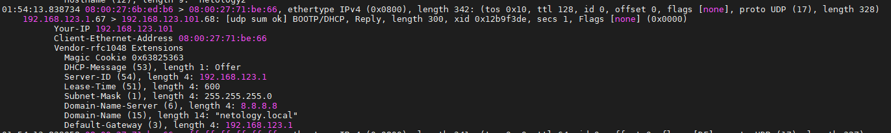
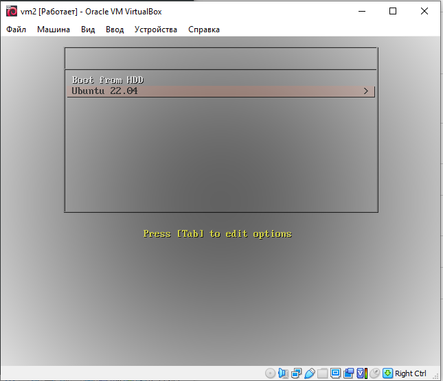

# Задание 1.
Для чего служит протокол DHCP?

Может ли работать сеть без DHCP-сервера?

*Приведите ответ в свободной форме.*  

# Ответ:
DHCP служит для автоматической конфигурации сетевых параметров, таких как: ip, сетевая маска, 
шлюз по умолчанию и дополнительных опций, таких как сервер загрузки и имя файла загрузки.

Да, сеть без DHCP работать может. DHCP служит для автоматического получения параметров, но можно 
те же параметры настроить и вручную, через конфиг. файлы или утилиты.

---

# Задание 2.
На каком порту/портах работает DHCP?

*Приведите ответ в свободной форме.*  

# Ответ:  
DHCP работает по портам 67/UDP, 68/UDP. Для запроса от клиента серверу используется 67/UDP,
сервер отвечает клиенту на 68/UDP.

---

# Задание 3.
Какие настройки можно произвести используя опции?

Назовите 5.

*Приведите ответ в свободной форме.*  

# Ответ:
- адреса серверов NTP
- DNS суффикс
- основной шлюз
- адрес сервера DNS
- список NetBios-серверов  

---

# Задание 4.
Сконфигурируйте сервер DHCP.

*Пришлите получившийся конфигурационный файл.*

# Ответ:  
[dhcp.conf](dhcpd.conf)  

---

# Задание 5.
Поймайте в сети пакеты DHCP любым сниффером.

*Пришлите скриншот пойманого одного пакета с объяснением что это за пакет, какой шаг получения сетевых настроек.*

# Ответ:  
  

На скриншоте приведен пакет DHCPOffer, т.е DHCP сервер уже найден и на этом этапе идет "предложение"
ip-адреса.  

---

# Задание 6.
Сконфигурируйте сервер PXE, выложите любой образ.

*Пришлите скриншот клиента, который получил настройки и подключился к PXE-серверу.*  

# Ответ:  
  

