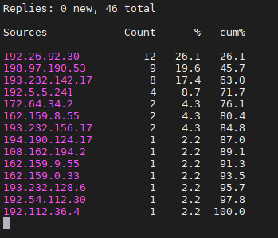

# Задание 1.
Может ли компьютер работать без DNS? Будет ли работать сеть если в ней нет DNS-сервера?

*Приведите ответ в свободной форме.*  

# Ответ:  
Да, может, только в таком случае придеться обращаться к ресурсам по IP-адресам, вместо символьных имен.  

# Задание 2.
Кто выдает DNS имена?

*Приведите ответ в свободной форме.*  

# Ответ:  
DNS имена выдает регистратор - орган, который может выдавать доменные имена в одном или нескольких доменах 
высшего уровня и регистрировать их при помощи сервиса InterNIC — корпорации по управлению доменными именами 
и IP-адресами ICANN, которая следит за уникальностью доменных имен на просторах интернета.  

# Задание 3.
Где в Linux настраивается DNS-клиент в простейшем случае?

*Приведите ответ в свободной форме.*  

# Ответ:  
В простейшем случае, DNS клиент, настраивается в файле `/etc/resolv.conf`  

# Задание 4.
Для чего служит ресурсная DNS запись типа MX?

*Приведите ответ в свободной форме.*  

# Ответ:  
MX - Mail Exchanger. Указывает, куда отправлять  эл. почту.
Т.е, чтобы отправить электронную почту, сервер-отправитель запрашивает у DNS-сервера MX-запись домена получателя
электронного сообщения. В результате запроса возвращается список имен почтовых серверов,
принимающих входящую почту для данного домена.  

# Задание 5.
Настройте кэширующий DNS сервер `BIND`.

С любого клиента отправьте запрос на преобразование адреса `netology.ru`.

С помощью утилиты dnstop посмотрите какие входящие и исходящие запросы обрабатывались DNS-сервером.

*Пришлите скриншот, на котором в выводе команды `dnstop` будут отбражены внешние DNS-сервера, на которые были 
отправлены рекурсивные запросы для преобразования адреса `netology.ru`.*  

# Ответ:  

