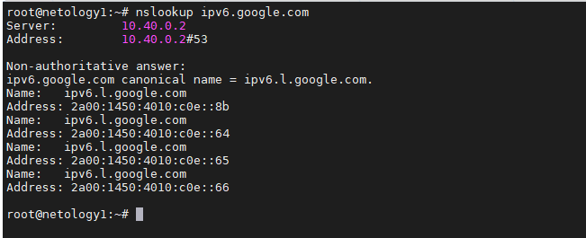

# Задание 1.
Какая нотация используется для записи IPv6-адресов:

* какие и сколько символов?
* какие разделители?

*Приведите ответ в свободной форме.*  

# Ответ:  
Адрес IPv6 записывается в шестнадцатеричном формате. Используется 8 групп по 4 разряда, 
в качестве разделителей используются двоеточия.  

---

# Задание 2.
Какой адрес используется в IPv6 как loopback?

*Приведите ответ в свободной форме.*  

# Ответ:  
 `0:0:0:0:0:0:0:1/128`, либо можно записать как `::1/128`  

---  

# Задание 3.
Что такое Unicast, Multicast, Anycast адреса?

*Приведите ответ в свободной форме.*  

# Ответ: 
* **Unicast** - одноадресная передача между двумя узлами.  
* **Multicast** - используется для передачи группе узлов.  
* **Anycast**  - передача ближайшему узлу из группы.  
---  

# Задание 4.
Используя любую консольную утилиту в Linux, получите IPv6-адрес для какого либо ресурса.

*В качестве ответа приложите скриншот выполнения команды.*  

# Ответ:  
  

---

# Задание 5.
* Как выглядят IPv6-адреса, которые маршрутизируются в интернете?
* Как выглядят локальные IPv6 адреса?

*Приведите ответ в свободной форме.*  

# Ответ:  
* Маршрутизируемые в интернете адреса IPv6 начинаются с **2**, например 
`2001:0db8:85a3::8a2e:0370:7334`
* Локальные IPv6 адреса, начинаются с **FC** или **FD**, либо если адрес
был получен с помощью автоконфигурации, то он начинается с **FE**.
Например:  `fde8:86a5:fc91:1:59a2:3149:c5a0:67a4`