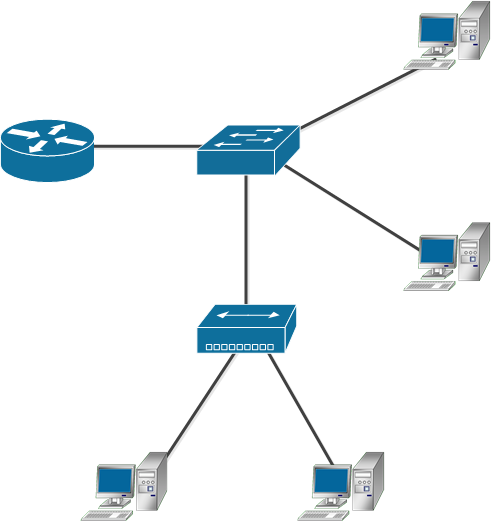
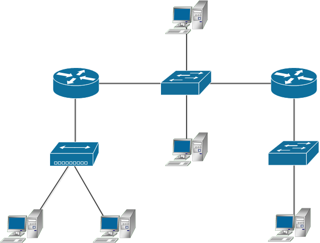

# Задание 1.
Адрес канального уровня – MAC адрес – это 6 байт, первые 3 из которых называются OUI – Organizationally Unique 
Identifier или уникальный идентификатор организации.

Какому производителю принадлежит `MAC 38:f9:d3:55:55:79`?

*Приведите ответ в свободной форме.*  

# Ответ:  
MAC `38:f9:d3:55:55:79` принадлежит Apple, Inc.  

---

# Задание 2.
Какой ключ нужно добавить в tcpdump, чтобы он начал выводить не только заголовки, но и содержимое фреймов в:

* текстовом виде;
* текстовом и шестнадцатиричном виде?
*Приведите ответ в свободной форме.*  

# Ответ:  
* текстовом виде - необходимо использовать ключи `-eA`; 
* текстовом и шестнадцатиричном виде - необходимо использовать ключи `-exx`;  

---  

# Задание 3.
1. Можно ли изменить MAC-адрес вашего Linux сервера?
2. Если да, то какой командой, если нет - почему?
3. Для чего может понадобиться изменять MAC-адреса?
*Приведите ответ в свободной форме.*  

# Ответ:  
1. Да, это возможно сделать
2. `sudo ip link set dev <interface> address <new mac>`
3. Например: скрыть "реального" произовдителя оборудования, обойти фильтрацию по MAC, 
изменить IP адрес (если настраивается по DHCP)...  

---  

# Задание 4.
1. Каким образом можно зафиксировать соответствие IP-MAC и избежать установления этого соответствия по протоколу ARP?
2. Каковы положительные и отрицательные стороны такой настройки?
*Приведите ответ в свободной форме.*  

# Ответ:  
1. Задать статическую запись в ARP-таблице  
2. **Положительные**: уменьшение количества ARP-запросов. **Отрицательные**: не застрахованы от изменения IP или MAC 
адреса.  

---

# Задание 5.
Какой механизм проверки на наличие ошибок используется в Ethernet?

*Приведите ответ в свободной форме.*  

# Ответ:  
Проверка контрольной суммы.

---  

# Задание 6.
Как вы думаете, почему серверы в большинстве случаев подключают проводом, а не через WiFi?

*Приведите как можно больше доводов в свободной форме.*  
#Ответ:  
* Скорость передачи данных  
* Стабильность  
* WiFi - вся сеть один домен коллизий  
* Невозможность резервирования соединения 

---

# Задание 7.
Сколько доменов коллизий изображено на рисунке?

*Примечание:*

* нижнее устройство - хаб, работающий на 1-м уровне, которые переадресовывает всё, что приходит во все порты сразу, ничего не анализируя;
* в центре - коммутатор, работает на 2-м уровне.
* круглое устройство - маршрутизатор, работает на 3-м уровне модели OSI.  

  

# Ответ:  
На рисунке изображено 4 домена коллизий.  

---

# Задание 8.
Сколько широковещательных доменов изображено на рисунке?

*Примечание:* круглое устройство - маршрутизатор, работает на 3-м уровне модели OSI.  

  

# Ответ:  
На рисунке изображено 3 широковещательных домена.  

---

# Задание 9.
1. Собрите дамп трафика с помощью tcpdump на основном интерфейсе вашей виртуальной машины.
2. Посмотрите его через tshark или Wireshark (можно ограничить число пакетов -c 100).
3. Как на самом деле называется стандарт Ethernet, фреймы которого попали в ваш дамп?
4. Можно ли где-то в дампе увидеть OUI?

*Приведите ответ в свободной форме.*  

# Ответ:  
