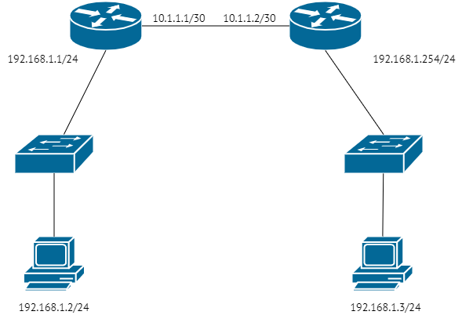
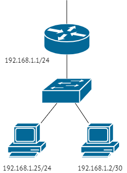
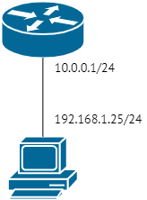

# Задание 1.
* Сколько доступно для назначения хостам адресов в подсети /25?
* А в подсети с маской 255.248.0.0.  

*Примечение: постарайтесь потренироваться в ручных вычислениях чтобы немного набить руку, не пользоваться калькулятором 
сразу.*

*Приведите ответ в свободной форме.*  

# Ответ:
* 126
* 524286

---

# Задание 2.
В какой подсети больше адресов, в /23 или /24?

*Приведите ответ в свободной форме.*

# Ответ:  
В подсети **/23** больше адресов, т.к хостовая часть у адреса с маской /23 больше, чем с маской /24

---

# Задание 3.
* Получится ли разделить диапазон 10.0.0.0/8 на 128 подсетей по 131070 адресов в каждой?
* Какая маска будет у таких подсетей?  

*Приведите ответ в свободной форме.*  

# Ответ:  
* Да, получится.
* У таких подсетей будет маска **/15**

---

# Задание 4.
С помощью дополнительных материалов укажите минимальную маску для подсети, в которой находится:

1. 12 хостов.
2. 39 хостов.
3. 2 хоста.
4. 4 хоста.  

*Примечение:* потренируйтесь указывать маску как в формате 255.255.255.0, так и в формате /24.  

*Приведите ответ в свободной форме.*  

# Ответ: 

1. /28, 255.255.255.240
2. /26, 255.255.255.192
3. /30, 255.255.255.252
4. /29, 255.255.255.248  

---

# Задание 5.
Используя свои знания про L2 и L3, поразмышляйте:

* получится ли отправить пакет с компьютера 192.168.1.2 на компьютер 192.168.1.3 если они подключены согласно приведённой 
ниже схеме?  

  

*Дайте максимально развернутый ответ.*  

# Ответ:  

---

# Задание 6.
Используя свои знания про маску подсети, L2 и L3, ответьте на вопросы:

* смогут ли общаться между собой компьютеры 192.168.1.25/24 и 192.168.1.2/30?
* сможет ли выйти в интернет компьютер 192.168.1.25/24, если шлюзом прописан маршрутизатор 192.168.1.1?
* сможет ли выйти в интернет компьютер 192.168.1.2/30, если шлюзом прописан маршрутизатор 192.168.1.1?

  

*Дайте максимально развернутый ответ.*  

# Ответ:  

---

# Задание 7.
Мы купили новый роутер, в инструкции написано, что у него статический адрес 10.0.0.1/24.

На нашем компьютере прописан адрес 192.168.1.25/24, шлюз по-умолчанию 192.168.1.1.

* откроется ли окно для настройки роутера если ввести адрес 10.0.0.1 в браузер?
почему?
* что рекомендуется делать в таком случае?  

  

*Приведите ответ в свободной форме.*  

# Ответ:  
* Нет, не откроется
* Адреса 10.0.0.1/24 и 192.168.1.25/24 находятся в разных сетях. Компьютер не сможет обнаружить адрес 10.0.0.1/24
и будет отправлять запросы на шлюз 192.168.1.1, а устройства с таким адресом в сети нет.
* В таком случае рекомендуется выдавать компьютеру и роутеру адреса из одной сети.
Например: 192.168.1.25/24 и 192.168.1.26/24

---

# Задание 8.
Выберите корректные IP-адреса
<table>
<tr><th>№</th><th>IP</th></tr>
<tr><td>1.</td><td>192.168.1.1</td></tr>
<tr><td>2.</td>	<td>273.566.48.1</td></tr>
<tr><td>3.</td>	<td>90.90.10.1</td></tr>
<tr><td>4.</td>	<td>192.168.3</td></tr>
<tr><td>5.</td>	<td>0.165.14.5</td></tr>
<tr><td>6.</td>	<td>1.1.1.1</td></tr>
</table>
*В ответе приведите номера корректных пунктов. При желании напишите, что не так у остальных.*  

# Ответ:  
Корректные адреса: 1,3,6.  
2 - Число в любом октете адреса, не может быть больше 255
4 - количество октетов должно быть 4
5 - Адрес не может начинаться с 0