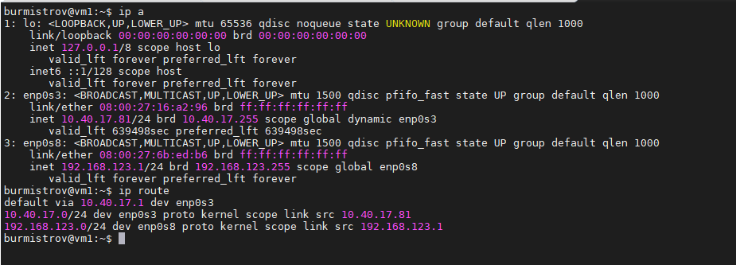
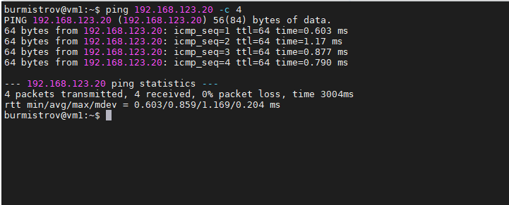
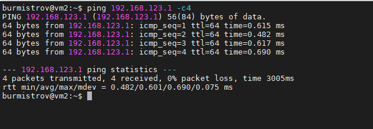
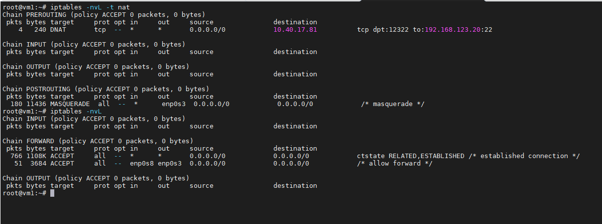
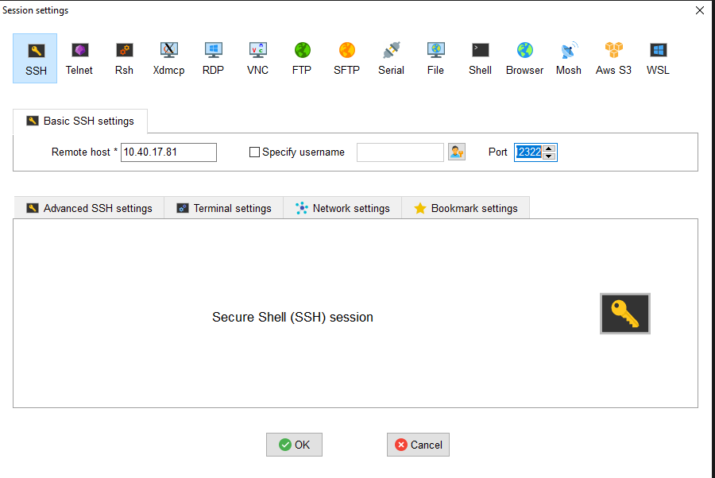
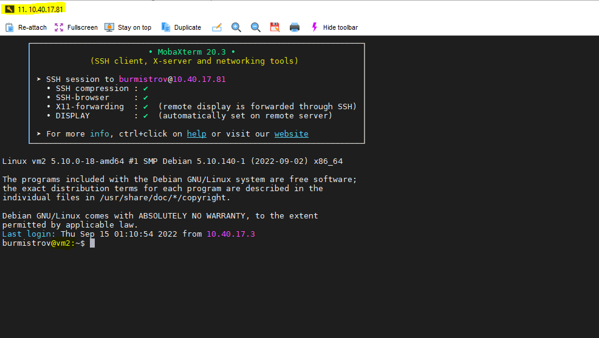

# Задание 1.
1.1 Создайте с помощью VirtualBox две виртуальных машины с debian, назовите их vm1 и vm2  
1.2 В VirtualBox создайте виртуальную сеть 192.168.123.0/24  
1.3 В VirtualBox настройте сетевые интерфейсы vm1 так, чтобы один интерфейс имел доступ в интернет (bridge или NAT), 
а второй интерфейс смотрел в виртуальную сеть 192.168.123.0/24  
1.4 В VirtualBox настройте сетевой интерфейс vm2 так, чтобы он смотрел только в виртуальную сеть 192.168.123.0  
1.5 Для vm1: настройте статический IP адрес у интерфейса смотрящего в сеть 192.168.123.0 (адрес в сети 123.0 выберите
на своё усмотрение). Настройте IP адрес интерфейса смотрящего в вашу локальную сеть так, чтобы c vm1 ходили пинги 
до 8.8.8.8.  
1.6 Для vm2: настройте статический IP адрес у интерфейса смотрящего в сеть 192.168.123.0   
(адрес в сети 123.0 выберите на своё усмотрение), шлюзом укажите IP vm1 из сети 192.168.123.0  
1.7 Попингуйте vm2 с vm1 по IP и приложите скриншот результата  
1.8 Попингуйте vm1 с vm2 по IP и приложите скриншот результата  
1.9 Настройте пересылку трафика на vm1, чтобы с vm2 можно было попинговать 8.8.8.8 и приложите скриншот результата  

*Приведите ответ в виде скриншотов настроек IP-адресов интерфейсов, таблиц маршрутизации, конфигурации файервола и 
результатов выполнения всех упомянутых проверок ping.*

# Ответ:

  
  
  
  
  
  

---

# Задание 2.
Настройте проброс портов из локальной сети компьютера с VirtualBox через vm1 порт 12322 в виртуальную сеть VirtualBox 
на 22 порт vm2, и подключитесь к vm2 по ssh через Putty как было показано на уроке   
*Приведите ответ в виде скриншотов.*  

# Ответ:  

