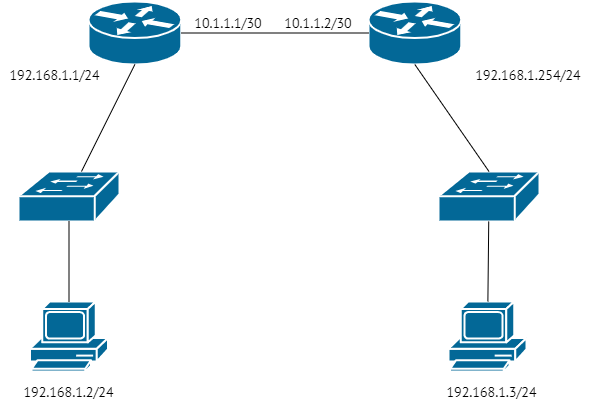

# Задание 1.
Вы подняли на своём домашнем компьютере с IP-адресом 192.168.0.2 web-сервер.

* Получится ли у пользователей интернета открыть этот сайт?
* Нужно ли будет вам для этого что-то сделать дополнительно?
* Существует ли такой набор настроек провайдера, который не позволит подключение?
Поразмышляйте над примером.

*Приведите ответ в свободной форме.*  

# Ответ:  
* Нет, не получится. Т.к веб серверу назначен адрес из диапазона серой сети, т.е
не маршрутизируемой в интернет. Веб сервер будет доступен только в пределах локальной сети.
* Для того, чтобы веб сервер был доступен из интернет необходим белый IP адрес, который назначается 
который назначается на интерфейс устройства, через которое осуществляется доступ в интернет.
После того, как адрес будет получен, на устройстве настраивается DNAT.
* Как вариант, если файервол провайдера не пропускает обращения по протоколу http.
либо провайдер не выдает белые ip адреса.

---

# Задание 2
* Узел src инициировал соединение с узлом dst.
* На маршрутизаторе узла src была создана трансляция:  
<table>
<tr><th>src local IP:port</th><th>src global IP:port</th><th>dst IP</th><th>protocol</th></tr>  
<tr><td>10.0.0.2:1111</td><td>93.15.10.2:2222</td><td>1.1.1.1:80</td><td>tcp</td></tr>
</table>

Применив знания по установке TCP сессий, ответьте на вопросы:

* Сможет ли злоумышленник доставить пакет до 10.0.0.2, отправив пакет на адрес/порт 
93.15.10.2:2222 с адреса 74.5.12.4?
* А если злоумышленник подменит source IP-адрес и сгенерирует пакет с source IP:port - 1.1.1.1:80
*Приведите ответ в свободной форме.*  

# Ответ:  
* Нет, не сможет. Т.к в полученном пакете адрес будет отличаться от адреса, указанного
в таблице трансляции, т.о пакет будет отброшен.
* Такой вариант возможен, но только при условии, если злоумышленник смог узнать текущие значения
параметров Sequence Number и Acknowledgment Number

---

# Задание 3
* Узел src инициировал соединение с узлом dst.
* На маршрутизаторе узла src была создана трансляция:  
<table>
<tr><th>src local IP:port</th><th>src global IP:port</th><th>dst IP</th><th>protocol</th></tr>  
<tr><td>10.0.0.2:1111</td><td>93.15.10.2:2222</td><td>8.8.8.8:53</td><td>udp</td></tr>
</table>

Применив знания по установке TCP сессий, ответьте на вопросы:

* Сможет ли злоумышленник доставить пакет до 10.0.0.2, отправив пакет на адрес/порт 93.15.10.2:2222 с адреса 74.5.12.4?
* А если злоумышленник подменит source IP-адрес и сгенерирует пакет с source IP:port - 8.8.8.8:53  

*Приведите ответ в свободной форме.*  

# Ответ:
* Нет, не сможет. Т.к в полученном пакете адрес будет отличаться от адреса, указанного
в таблице трансляции, т.о пакет будет отброшен.
* Да, это возможно, т.к в отличии от TCP, протокол UDP Не имеет средств идентификации
пакетов.

---

# Задание 4.
Найдите самую часто встречающуюся проблему при работе клиентов за NAT с протоколом FTP, связанную с особенностью работы FTP (на лекции по портам эта особенность упоминалась).

1. В чём выражается проблема?
2. Почему она возникает?
3. Что можно сделать, чтобы избежать этой проблемы?
*Приведите ответ в свободной форме.*  

# Ответ:  

1. Наиболее распространенная проблема при работе FTP через NAT - это работа FTP
в активном режиме.  
2. В активном режиме сервер устанавливает соединение на порт указанный клиентом.
Соответственно сервер находящийся за NAT передает свой внутренний адрес.
3. В большинстве случаев для нормальной работы FTP-сервера за NAT 
достаточно будет пробросить 21 порт для управляющей сессии, 20 - для активного режима (если используется), а также 
указать и пробросить диапазон динамических портов для передачи данных.  

---

# Задание 5.
Вспомните схему из 3-го урока.  

  

Немного перефразируем прошлый вопрос.

* Поразмышляете, можно ли каким-то образом отправлять пакеты с компьютера 192.168.1.2 на компьютер 192.168.1.3 если они подключены согласно приведённой ниже схеме?
* Если да, то что и как бы вы предложили настроить? Как и к чему нужно подключаться?
*Приведите ответ в свободной форме.*  

# Ответ:  
