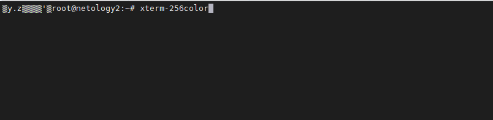
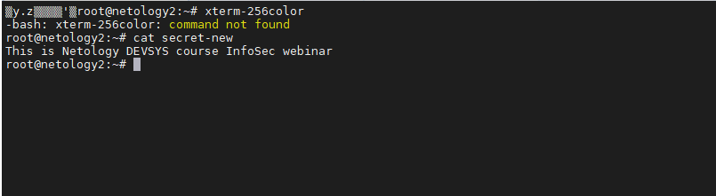

# Задание 1.
Как вы думаете, если вы пользуетесь коммерческим VPN-сервисом для доступа к заблокированным сайтам по протоколу TLS, 
является ли передаваемая информация полностью защищённой?

*Приведите ответ в свободной форме.*

# Ответ:  
Нет, т.к весь трафик отправляется и контролируется серверами компании предоставляющей
сервис VPN. Возможно перехватить и расшифровать передаваемые данные.
---

# Задание 2.
Какой протокол VPN вы выберете для подключения к VPN серверу изнутри локальной сети, в которой открыт доступ наружу 
только по протоколам `HTTP` и `HTTPS`?

*Приведите ответ в свободной форме.*  

# Ответ:  
**SSTP** - т.к он работает по SSL через 443 порт, **OpenVPN**, т.к он так же может работать через 443 порт,
либо использовать **Clientless SSL VPN**, например Cisco AnyConnect

---

# Задание 3.
Какой тип VPN вы бы использовали для подключения 100 "удалённых" пользователей к серверам, находящимся в центральном 
офисе?

Объясните ваше решение.

*Приведите ответ в свободной форме.*  

# Ответ:  
**Clientless SSL VPN** - т.к он не требует настройки на каждом конкретном клиенте,
для подключение достаточно браузера.

---

# Задание 4.
**Симметричное шифрование (одинаковый ключ на зашифровку и расшифровку).**

Создайте 2 виртуальных машины. При необходимости можете использовать приложенный файл Vagrantfile

Создайте файл `secret` на компьютере **netology1**

`root@netology1:~# echo 'This is Netology DEVSYS course InfoSec webinar' > secret`

Зашифруйте файл `secret` в файл `secret.encrypted`, введя ключ.

`root@netology1:~# gpg --output secret.encrypted --symmetric --cipher-algo AES256 secret`

На машине **netology2** запустите утилиту `netcat` на порту 5000 (от `root`) и сохраните то, что будет передано в порт 
5000, сохраните в файл `secret-new.encrypted`

`root@netology2:~# nc -l -p 5000 -q 1 > secret-new.encrypted < /dev/null`

На машине **netology1** отправьте файл `secret.encrypted` на адрес `172.28.128.60` на порт 5000

`root@netology1:~# cat secret.encrypted | nc 172.28.128.60 5000`

На машине **netology2** расшифруйте файл из `secret-new.encrypted` в `secret-new`

`root@netology2:~# gpg --output secret-new --decrypt secret-new.encrypted`

В качестве ответа приведите вывод 2-х команд с хоста **netology2**, куда вы передали файл:

`cat secret-new.encrypted`  
`cat secret-new`  

# Ответ:  
  

