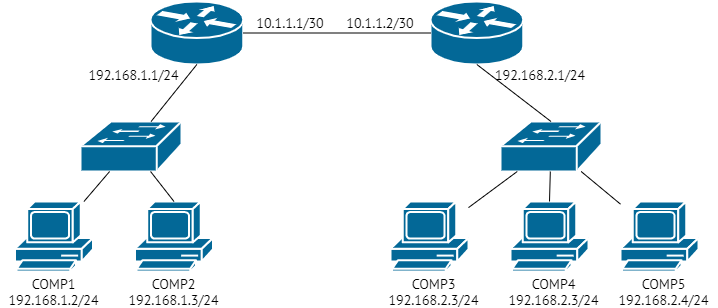

# Задание 1.
1. Укажите путь к файлам логов веб-сервера Nginx.
2. Где находится конфигурационный файл, в котором можно посмотреть / поменять эти пути?
3. Какой командой можно воспользоваться для просмотра файла журнала в режиме реального времени? Попробуйте найти сами, либо воспользуйтесь ссылкой.

*Приведите ответ в свободной форме.*  

# Ответ:
1. /var/log/nginx  
2. /etc/nginx/nginx.conf
3. tail -f /var/log/nginx/access.log, либо journalctl -f -u nginx

---

# Задание 2.
Познакомьтесь со схемой сети.  

  

1. COMP1 не может обменяться данными с COMP4. Какую последовательность действий вы выберете для того, чтобы локализовать
проблему?
2. Возможно ли, чтобы при выполнении ping 192.168.1.2 с компьютера COMP5, ping прошёл, а подключение по HTTP с COMP5 
на COMP1 не проходило бы? Поясните свой ответ максимально детально.
3. COMP5 отправляет ping на COMP1 и COMP2, при этом COMP1 на ping отвечает, а COMP2 - нет.  

Приведите максимальное количество причин. Самую простую, но нередко встречающуюся - «У COMP2 выдернули кабель 
питания» - я уже ответил за вас.  

4. COMP1 пингует только адреса из подсети 192.168.1.0/24 (COMP2 и 192.168.1.1), больше никакие адреса не пингуются.
С чем это может быть связано?  

Приведите ответ в свободной форме.  

# Ответ:  
1. Traceroute до 192.168.2.1/24, если ответ есть, то начинаем разбираться с сегментом
192.168.2.0/24. Проверяем целостность кабеля на участках маршрутизатор - коммутатор и коммутатор - Comp4.
Проверяем есть ли мак Comp4 на коммутаторе и исправен/корретно настроен порт.
Смотрим arp таблицу, которая нам и покажет дублирование ip адресов.
2. Да, возможно. Если не работает веб сервер на Comp1. Можно предположить, что на маршрутизаторах есть firewall 
и он блокирует подключение по порту 80.
3. Comp2 завис, повреждена витая пара Comp2 - коммутатор, неисправна сетевая карта на Comp2,
не указан шлюз по умолчанию или обратный маршрут до 192.168.2.3/24 на Comp2, неисправен, не настроен или отключен порт 
на коммутаторе, куда подлючается Comp2, пользователь установил персональный firewall и заблокировал
все соединения, заблокирован mac адрес на коммутаторе.
4. Поврежден кабель соединяющий маршрутизаторы, нет на первом маршрутизаторе нет маршрута
до других сетей, на втором нет обратного маршрута, если допустить, что на маршрутизаторах есть сетевой экран, возможна
некорректная настройка.  

---  

# Задание 3.
Используя схему из Задания 2, попробуйте ответить на вопросы:

1. COMP1 и COMP2 оба пингуют 10.1.1.2, однако не пингуют 192.168.2.1 и прочие адреса из 192.168.2.0/24. Как вы думаете, что не так и как это можно исправить?
2. Какими способами мы можем сделать так, чтобы COMP2 не смог общаться ни с кем кроме своей локальной сети? (Приведите вариант с настройками самого COMP2 и попробуйте придумать, можно ли что-то сделать на маршрутизаторе 192.168.1.1)
3. Как вы думаете, что будет происходить при попытке провести ping с COMP5 на 192.168.2.3 ?

*Приведите ответ в свободной форме.*  

# Ответ:  
1. Скорее всего нет маршрута/либо некорректный маршрут до 192.168.2.0/24
Подключаемся на маршрутизатор 2, смотрим таблицу маршрутизации и исправляем некорректный маршрут.
2. Убрать из сетевых параметров Comp2 шлюза оп умолчанию, либо задать некоррекные маршруты до других сетей.
Если брать пример параметров маршрутизатора, то при наличии firewall, можно закрыть доступ к внешним сетям,
для ip адреса Comp2. Либо промаркировать траффик и траффик от Comp2 не выпускать дальше 192.168.1.1  
3. Ping будет идти только до одного из компьютеров. При попытке провести ping со 192.168.2.3
с одного из компьютеров все будет ок, с дргуого будут потери пакетов, либо не будет работать.

---  

# Задание 4.
* Сделайте ping с одной виртуальной / физической машины на другую.  
* Используя описание утилиты iperf, загрузите канал между двумя виртуальными машинами на максимум, например, на 60 секунд, в процессе загрузки повторите ping.  
* Изменились ли цифры в ответе команды ping? Почему? Есть ли разница между физическими и виртуальными машинами?  

*Приведите скриншоты/ответы команд до и во время высокой загрузки каналов.*  

# Ответ:  
  

  

В моем случае (iperf между двумя виртуальными машинами), в случаях до запуска и после
цифры изменились незначительно. Предполагаю, что это из-за того, что машины "общаются"
через виртуальную сетевую карту, которая обслуживается ресурсами хост-машины.
Iperf запускался командами:  
Сервер: `iperf3 -s -D`  
Клиент: `iperf3 -c 192.168.123.20 -f m -P 8 -t 60 -w 32768`

