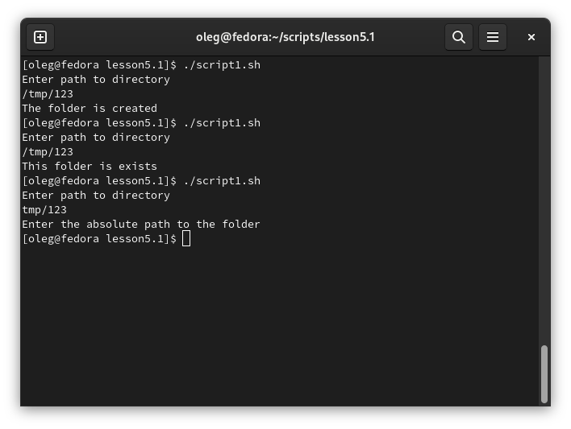

# Задание 1.
Напишите скрипт, который при запуске спрашивает у пользователя путь до директории и создает ее при 
условии, что ее еще не существует. Если директория существует – пользователю выводится сообщение, что директория 
существует. Скрипт должен принимать абсолютный путь до директории, например /tmp/testdir или /home/user/testdir

*Пришлите получившийся код и скриншот, показывающий работу скрипта в качестве ответа.*  

# Ответ:  
[script1](script1.sh)  
