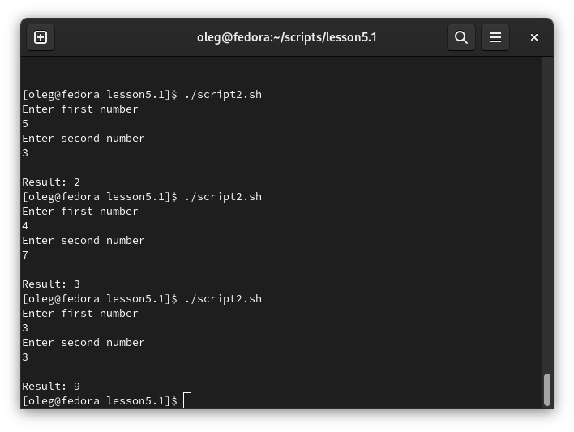
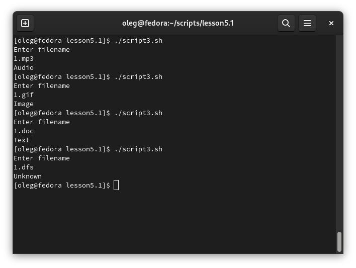

# Задание 1.
Напишите скрипт, который при запуске спрашивает у пользователя путь до директории и создает ее при 
условии, что ее еще не существует. Если директория существует – пользователю выводится сообщение, что директория 
существует. Скрипт должен принимать абсолютный путь до директории, например /tmp/testdir или /home/user/testdir

*Пришлите получившийся код и скриншот, показывающий работу скрипта в качестве ответа.*  

# Ответ:  
[script1](script1.sh)  
  

---

# Задание 2.
Напишите скрипт:

При запуске скрипта пользователь вводит два числа.
Необходимо вычесть из большего числа меньшее и вывести результат в консоль.
Если числа равны – умножить их друг на друга (или возвести в квадрат одно из чисел) и вывести результат в консоль.

*Пришлите получившийся код и скриншот, показывающий работу скрипта в качестве ответа.*    

# Ответ:  
[script2](script2.sh)  
  

---

# Задание 3.
Напишите скрипт с использованием оператора case:  

1. При запуске скрипта пользователь вводит в консоль имя файла с расширением, например 123.jpg или track.mp3.
2. Необходимо сообщить пользователю тип файла.  

* Если jpg, gif или png – вывести слово «image»  
* Если mp3 или wav – вывести слово «audio»  
* Если txt или doc – вывести слово «text»  
* Если формат не подходит под заданные выше – написать «unknown»  

*Пришлите получившийся код и скриншот, показывающий работу скрипта в качестве ответа.*  

# Ответ:  
[script3](script3.sh)  
  
