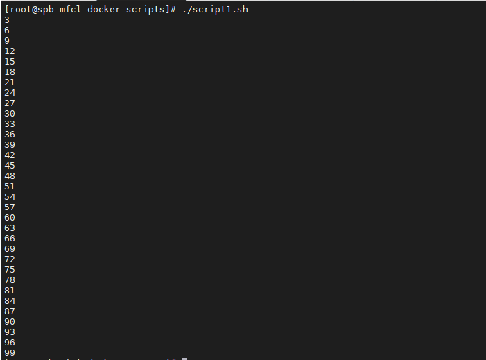
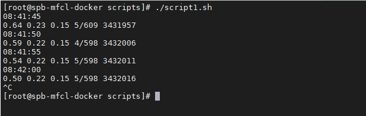

# Задание 1.
Напишите скрипт, который выводит на экран все числа от 1 до 100, которые делятся на 3.

*Пришлите получившийся код и скриншот, показывающий работу скрипта в качестве ответа.*  

# Ответ:  

[script1](script1.sh)  

---

# Задание 2.
Напишите скрипт, который каждые 5 секунд будет выводить на экран текущее время и содержимое файла /proc/loadavg.

*Пришлите получившийся код и скриншот, показывающий работу скрипта в качестве ответа.*  

# Ответ:  

[script2](script2.sh)  

  

---