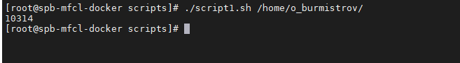

# Задание 1.
Напишите скрипт, который выводит на экран все числа от 1 до 100, которые делятся на 3.

*Пришлите получившийся код и скриншот, показывающий работу скрипта в качестве ответа.*  

# Ответ:  

[script1](script1.sh)  

---

# Задание 2.
Напишите скрипт, который каждые 5 секунд будет выводить на экран текущее время и содержимое файла /proc/loadavg.

*Пришлите получившийся код и скриншот, показывающий работу скрипта в качестве ответа.*  

# Ответ:  

[script2](script2.sh)  

  

---

# Задание 3.
Напишите функцию для подсчета среднего размера файла в директории.

* путь к директории должен передаваться параметром, например avgfile /home/username;
* функция должна проверять, что такая директория существует, подсчитывать и выводить на экран средний размер файла 
в ней;
* при подсчете не нужно учитывать поддиректории и символьные ссылки, считать только средний размер файлов 
* в заданной директории.

*Пришлите получившийся код функции и скриншот, показывающий работу функции в качестве ответа.*  

# Ответ:  

[script3](script3.sh)  

  

---