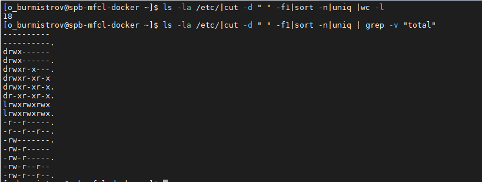
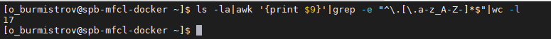

# Задание 1.
* Создайте файл с наполнением, используя несколько способов;  
* Используйте изученные на занятии текстовые редакторы для наполнения файлов произвольными данными.  

*Приведите ответ в свободной форме.*

# Ответ:  
* Использовать перенаправление вывода, например `ls -l ~/ > filename`  
* Использовать DocumentHere, например
```
cat << EOF
Some text
EOF
```
* Создаем используя текстовый редактор и наполянем вручную, `vim filename`. Для редактирования нажимаем `i` и 
вводим текст. После ввода, нажимаем `Esc`, чтобы перейти в командный режим. Нажимаем `:` и для сохранения и выхода
нажимаем `wq` или `!q` для выхода без сохранения.
 
---

# Задание 2.
* Выведите с помощью cat содержимое всех файлов в директории /etc (cat /etc/*);  
* Направьте ошибки в отдельный файл в вашей домашней директории.  

Сколько объектов не удалось прочесть?

*Пришлите получившийся скриншот вывода.*  

# Ответ:  
  

  

---  

# Задание 3.
* Используйте команду cut на вывод длинного списка каталога, чтобы отобразить только права доступа к файлам;  
* Отправьте в конвейере этот вывод на sort и uniq, чтобы отфильтровать все повторяющиеся строки;  
* С помощью wc подсчитайте различные типы разрешений в этом каталоге.  
* Уберите из подсчета строку total.  

*Пришлите получившийся скриншот вывода.*  

# Ответ:  
  

---

# Задание 4.
В ОС Linux скрытыми файлами считаются те, имена которых начинаются с точки.  

Сколько скрытых файлов в вашем домашнем каталоге?    

*Пришлите получившийся скриншот вывода.*  

# Ответ:  

