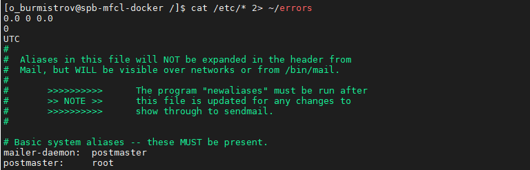
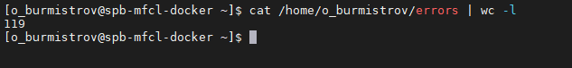

# Задание 1.
* Создайте файл с наполнением, используя несколько способов;  
* Используйте изученные на занятии текстовые редакторы для наполнения файлов произвольными данными.  

*Приведите ответ в свободной форме.*

# Ответ:  

---

# Задание 2.
* Выведите с помощью cat содержимое всех файлов в директории /etc (cat /etc/*);  
* Направьте ошибки в отдельный файл в вашей домашней директории.  

Сколько объектов не удалось прочесть?

*Пришлите получившийся скриншот вывода.*  

# Ответ:  
  

  

---
