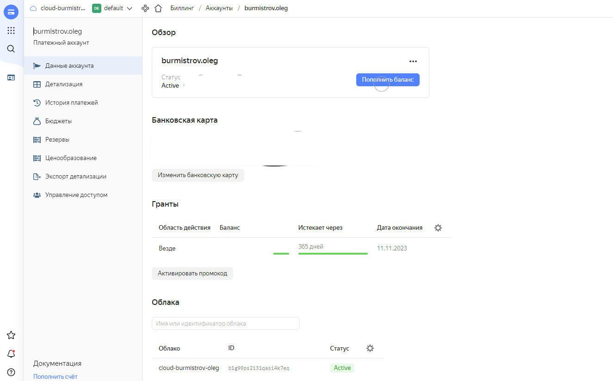

# Задание 1.
Чем частное облако отличается от общедоступного, публичного и гибридного?

*Приведите ответ в свободной форме.*  

# Ответ:  
**Частное облако** — это облачная инфраструктура, которая принадлежит одной компании.
Она развернута на базе собственной физической инфраструктуры компании или на арендованном оборудовании.  
**Публичное облако**  - вся виртуальная инфраструктура принадлежит провайдеру
**Гибридное** - это смесь частного и публичного, т.е часть инфраструктуры размещена на оборудовании принадлежащем 
провайдеру, а часть на собственных или арендованных мощностях.  

---

# Задание 2
Что обозначают: IaaS, PaaS, SaaS, CaaS, DRaaS, BaaS, DBaaS, MaaS, DaaS, NaaS, STaaS? Напишите примеры их использования.

*Приведите ответ в свободной форме.*  

# Ответ:  
* IaaS - Infrastructure as a service (Пример: Yandex Cloud, Amazon EC2)
* PaaS - Platform as a service  (Пример: Microsoft Azure)
* SaaS - Software as a service  (Пример: GoogleDoc, Yandex Диск)
* CaaS - Container as a service, либо Communications as a service (Пример: Google Container Engine, ВАТС)
* DRaaS - Disaster recovery as a service  (Пример: VMware vCloud Availability)
* BaaS - Backup as a service  (Пример: услуга автоматизированного резервного копирования данных в облаке)  
* DBaaS - Database as a service  (Пример: Google Cloud Databases)
* MaaS - Monitoring as a service (Пример: Anturis) 
* DaaS - Desktop as a service (Пример: VDI)
* NaaS - Network as a service  (Пример: AWS Networking and Content Delivery)
* STaaS - Storage as a service (Пример: Amazon S3)  

---

# Задание 3
Напишите, какой вид сервиса предоставляется пользователю, когда:

1. Управляет всеми процессами провайдер;
2. Вы управляете приложением и данными, остальным управляет провайдер;
3. Вы управляете операционной системой, средой исполнения, данными, приложениями, остальными управляет провайдер;
4. Вы управляете сетью, хранилищами, серверами, виртуализацией, операционной системой, средой исполнения, данными, 
приложениями;
*Приведите ответ в свободной форме.*  

# Ответ:  
1. PaaS
2. SaaS
3. IaaS
4. Классическая серверная инфраструктура  

---

# Задание 4
Легенда

Вы ИТ-специалист в своей компании. Перед вами встал вопрос: покупать физический сервер или арендовать 
облачный сервис https://cloud.yandex.ru .

Для этого Вам необходимо:

1. Создать аккаунт (платежный):  
* зайти в консоль;  
* выбрать меню биллинг;  
* зарегистрировать аккаунт.  
1. После регистрации выбрать меню в консоли Computer cloud.  
2. Приступить к созданию виртуальной машины.  
*Приложите скриншоты.*  

Ответьте на следующие вопросы:

1. Какие ОС можно выбрать?
2. Какие параметры сервера можно выбрать?
3. Какие компоненты мониторинга можно создать?
4. Какие системы безопасности предусмотрены?
5. Как меняется цена от выбранных характеристик? Приведите пример самой дорогой конфигурации и самой дешевой.

*Приведите ответы в свободной форме.*  

# Ответ:  
  
  

1. Можно выбрать: Ubuntu, CentOS, Debian, SLES, Fedora, SLES for SAP, openSUSE Leap, Fedora CoreOS, AlmaLinux,
Astra Linux, РедОС, Альт
2. Количество и размер дисков, возможность использования файлового хранилища, количество, платформа и процент использования процессоров, объем оперативной памяти,
параметры сети, внешний адрес
3. Установка агента для передача данных в Yandex Monitoring и сбора логов в Cloud Logging
4. Защита от DDOS
5.   
  

---

