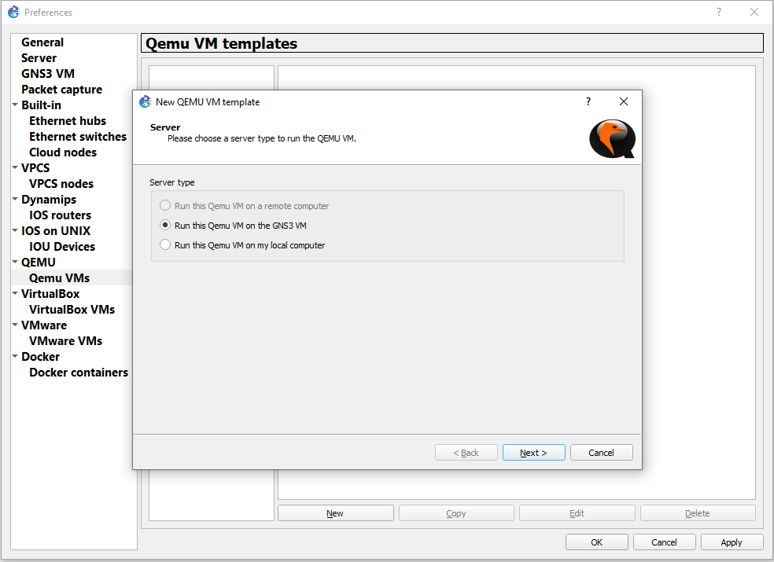
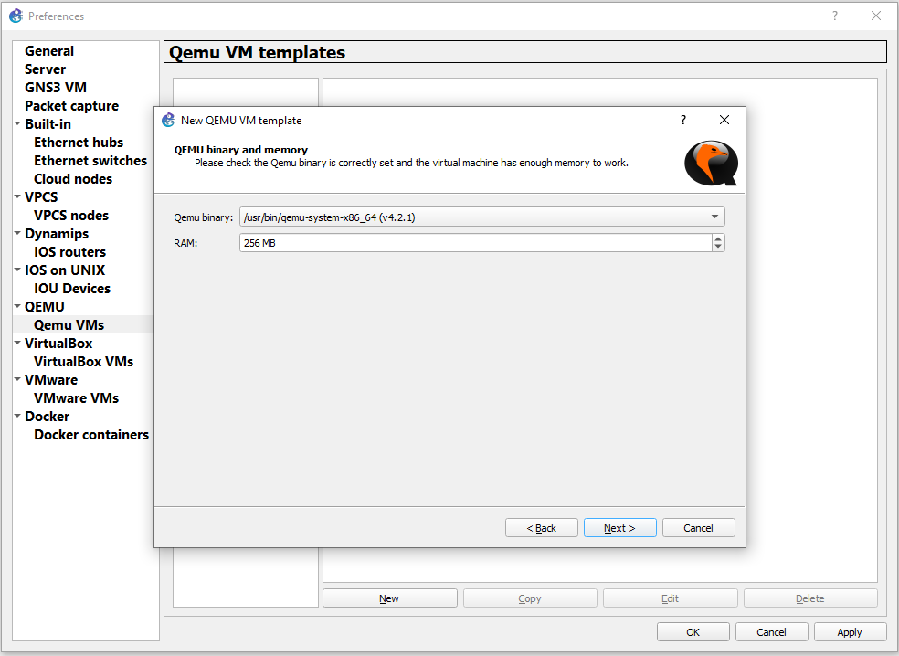
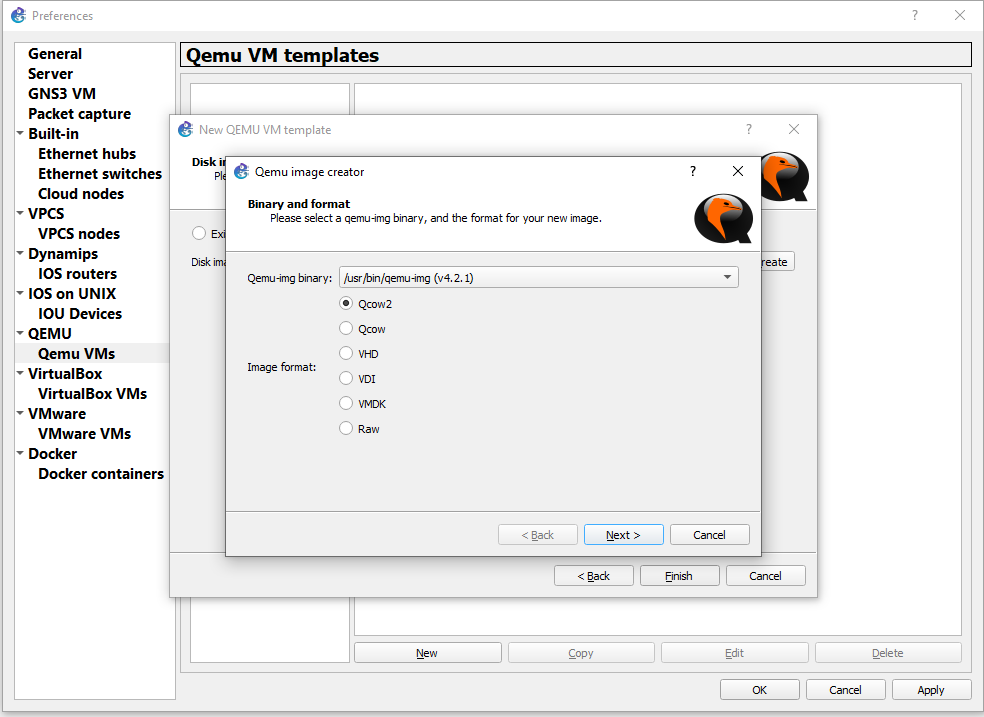
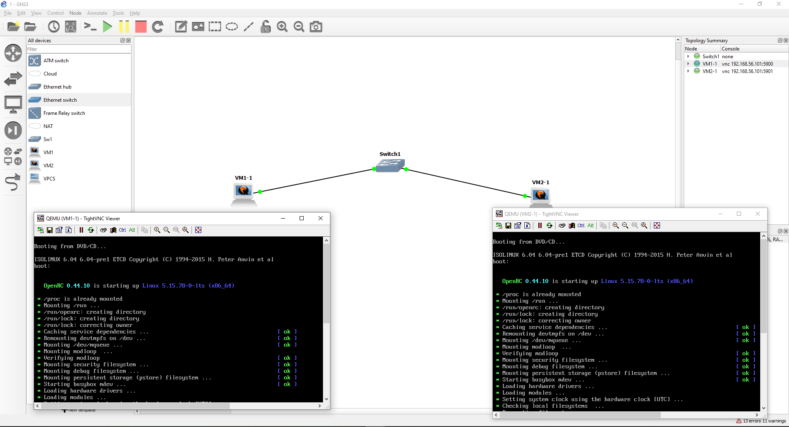

# Задание 1.
Какие виртуализации существуют? Приведите примеры продуктов разных типов виртуализации.

*Приведите ответ в свободной форме.*  

# Ответ:  
* Аппаратная (Пример: KVM, XEN, Hyper-V)
* Программная (Пример: OpenVZ)
* Контенерная (Пример: Docker)
* Хостинговая (Пример:Услуги облачных провайдеров)

---

# Задание 4
Создайте проект в GNS3 (предварительно установив GNS3 https://github.com/GNS3/gns3-gui/releases).  
Создайте следующую топологию.  

Для реализации воспользуйтесь QEMU машинами (можно дублировать, сделанную ранее).  
*Приложите скриншоты действий.*  

# Ответ:  
  
  
  

**Для второй виртуальной машины повторяем те же действия, что и для первой**  

  
