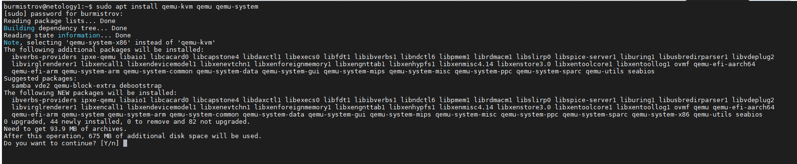

# Задание 1.
Какие виртуализации существуют? Приведите примеры продуктов разных типов виртуализации.

*Приведите ответ в свободной форме.*  

# Ответ:  
* Аппаратная (Пример: KVM, XEN, Hyper-V)
* Программная (Пример: OpenVZ)
* Контенерная (Пример: Docker)
* Хостинговая (Пример: Услуги облачных провайдеров)

---

# Задание 2
1. Установите QEMU в зависимости от системы (в лекции рассматривались примеры).  
2. Создайте виртуальную машину.  
3. Установите виртуальную машину. Для примера можете воспользоваться 
https://dl-cdn.alpinelinux.org/alpine/v3.13/releases/x86/alpine-standard-3.13.5-x86.iso.  

С сайта https://alpinelinux.org.

*Приложите скриншоты действий.*  

# Ответ:  
  
  

---

# Задание 3
1. Установите kvm и библиотеку libvirt (можете воспользоваться GUI версией из лекции).  
2. Создайте виртуальную машину.  
3. Установите виртуальную машину.   

Для примера можете воспользоваться 
https://dl-cdn.alpinelinux.org/alpine/v3.13/releases/x86/alpine-standard-3.13.5-x86.iso.
С сайта https://alpinelinux.org.

*Приложите скриншоты действий.*  

# Ответ:  
  

# Задание 4
Создайте проект в GNS3 (предварительно установив GNS3 https://github.com/GNS3/gns3-gui/releases).  
Создайте следующую топологию.  

Для реализации воспользуйтесь QEMU машинами (можно дублировать, сделанную ранее).  
*Приложите скриншоты действий.*  

# Ответ:  
  
  
  

**Для второй виртуальной машины повторяем те же действия, что и для первой**  

  

---

# Задание 5
Установите виртуальные (alpine) машины 2 различных архитектур, отличных от X86 в QEMU.

*Приложите скриншоты действий.*  

# Ответ:  
  

  

---

# Задание 6
Установите виртуальные (alpine) машины 2 различных архитектур, отличных от X86 в KVM.

*Приложите скриншоты действий.*  

# Ответ:  
