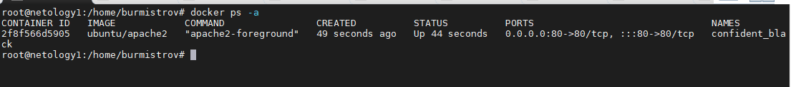

# Задание 1.
Чем контейнеризация отличается от виртуализации?

*Приведите ответ в свободной форме.*  

# Ответ:  
В отличии от классической виртуализации, в которой помимо запущенного приложения,
виртуализируется операционная система, аппаратные средства ПК, в контейнеризации 
виртуализируется только запущенное приложение и его зависимости, операционная система и
аппартаные средства используются с хост машины.  

---

# Задание 2.
Установите Docker.

*Приложите скриншот*  

# Ответ:  
  

---

# Задание 3.
Запустите образ hello-world.

*Приложите скриншот*  

# Ответ:  
  

---

# Задание 4.
Удалите образ hello-world.

*Приложите скриншот*  

# Ответ:  
  

---

# Задание 5*.
Найдите в Docker Hub образ apache и установите его.

*Приложите скриншот сетевых настроек вашей виртуальной машины, скриншот работающих контейнеров, скриншот браузера, 
где вы открыли дефолтную страницу вашего apache внутри контейнера*  

# Ответ:  
  

  

---
# Задание 6*.
Создайте свой Docker образ с Apache2 и подмените стандартную 
страницу index.html на страницу содержащую ваши ФИО.

*Приложите скриншот содержимого Dockerfile. Приложите скриншот браузера,
где apache2 из вашего контейнера выводит ваши ФИО*   

# Ответ:  
  

