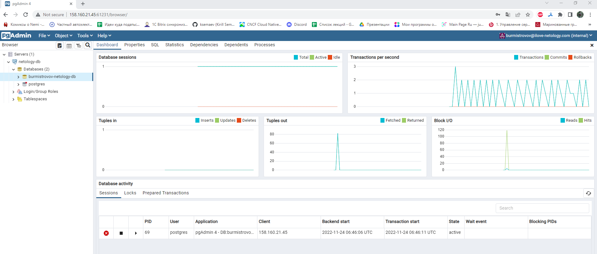
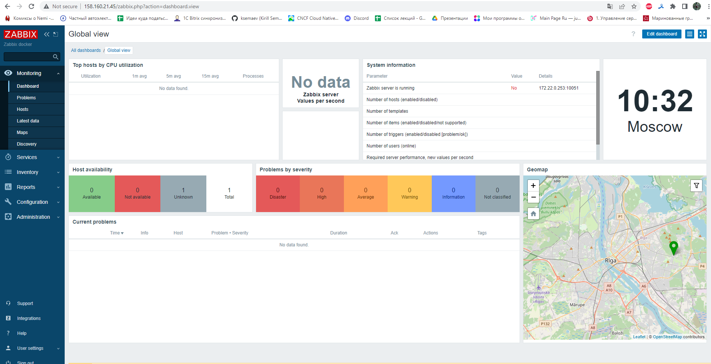
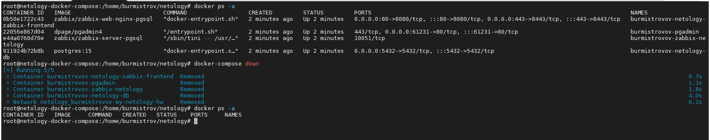

# Задание 1.
Установите Docker Compose. Опишите, для чего нужен Docker Compose и как он может улучшить вашу жизнь.

*Приведите ответ в свободной форме на 1 абзац текста*  

# Ответ:  
Docker Compose - инструментальное средство, входящее в состав Docker и позволяющее управлять группой контейнеров.
Позволяет разворачивать приложения, отличающиеся сложной архитектурой. 
Например, чтобы развернуть веб сервер, систему мониторинга и т.д достаточно описать необходимые сервисы и параметры в 
`docker-compose.yml` и дать команду `docker-compose up`, после чего контейнеры с необходимыми сервисами будут 
созданы автоматически за небольшое время. 

---

# Задание 2.
Создайте файл docker-compose.yml и внесите туда первичные настройки. version services

networks

При выполнении задания используйте подсеть 172.22.0.0 Ваша подсеть должна называться <ваши фамилия и инициалы>-my-netology-hw

*Приложите текст конфига на этом этапе*  

# Ответ:  
```
version: "3"
services:

networks:
  burmistrovov-my-netology-hw:
    driver: bridge
    ipam:
      config:
        - subnet: 172.22.0.0/24
```

---

# Задание 3.
Установите PostgreSQL с именем контейнера <ваши фамилия и инициалы>-netology-db. 
Предсоздайте БД <ваши фамилия и инициалы>-db Задайте пароль пользователя postgres как <ваши фамилия и инициалы>12!3!! 
Пример названия контейнера: ivanovii-netology-db.

Назначьте для данного контейнера статический IP из подсети 172.22.0.0/24.

*Приложите текст конфига текущего сервиса*  

# Ответ:  
```
version: "3"
services:
  burmistrovov-netology-db:
    image: postgres:15
    container_name: burmistrovov-netology-db
    restart: always
    ports:
      - 5432:5432
    volumes:
    - /tmp/pgdata:/var/lib/postgresql/data/pgdata
    environment:
      POSTGRES_PASSWORD: burmistrovov12!3
      POSTGRES_DB: burmistrovov-netology-db
    networks:
      burmistrovov-my-netology-hw:
        ipv4_address: 172.22.0.254 
networks:
  burmistrovov-my-netology-hw:
    driver: bridge
    ipam:
      config:
        - subnet: 172.22.0.0/24

```  

---

# Задание 4.
Установите pgAdmin с именем контейнера <ваши фамилия и инициалы>-pgadmin. Задайте логин администратора pgAdmin 
<ваши фамилия и инициалы>@ilove-netology.com и пароль на выбор.

Назначьте для данного контейнера статический IP из подсети 172.22.0.0/24. Прокиньте на 80й порт контейнера порт 61231

*Приложите текст конфига текущего сервиса Приложите скриншот админки pgAdmin*

# Ответ:  
```
version: "3"
services:
  burmistrovov-netology-db:
    image: postgres:15
    container_name: burmistrovov-netology-db
    restart: always
    ports:
      - 5432:5432
    volumes:
    - /home/burmistrov/pgdata:/var/lib/postgresql/data/pgdata
    environment:
      POSTGRES_PASSWORD: burmistrovov12!3
      POSTGRES_DB: burmistrovov-netology-db
      PGDATA: /var/lib/posgresql/data/pgdata
    networks:
      burmistrovov-my-netology-hw:
        ipv4_address: 172.22.0.254
  burmistrovov-pgadmin:
    image: dpage/pgadmin4
    container_name: burmistrovov-pgadmin
    restart: always
    ports:
      - 61231:80
    environment:
      PGADMIN_DEFAULT_EMAIL: burmistrovov@ilove-netology.com
      PGADMIN_DEFAULT_PASSWORD: Cd~7DPJW
    networks:
      burmistrovov-my-netology-hw:
        ipv4_address: 172.22.0.253
networks:
  burmistrovov-my-netology-hw:
    driver: bridge
    ipam:
      config:
        - subnet: 172.22.0.0/24
```

  

---

# Задание 5.
Установите Zabbix Server с именем контейнера <ваши фамилия и инициалы>-zabbix-netology. 
Настройте его подключение к вашему СУБД

Назначьте для данного контейнера статический IP из подсети 172.22.0.0/24.

*Приложите текст конфига текущего сервиса*  

# Ответ:  
```
version: "3"
services:
  burmistrovov-netology-db:
    image: postgres:15
    container_name: burmistrovov-netology-db
    restart: always
    ports:
      - 5432:5432
    volumes:
    - /home/burmistrov/pgdata:/var/lib/postgresql/data/pgdata
    environment:
      POSTGRES_PASSWORD: burmistrovov12!3
      POSTGRES_DB: burmistrovov-netology-db
      PGDATA: /var/lib/posgresql/data/pgdata
    networks:
      burmistrovov-my-netology-hw:
        ipv4_address: 172.22.0.254
  burmistrovov-pgadmin:
    image: dpage/pgadmin4
    container_name: burmistrovov-pgadmin
    restart: always
    ports:
      - 61231:80
    environment:
      PGADMIN_DEFAULT_EMAIL: burmistrovov@ilove-netology.com
      PGADMIN_DEFAULT_PASSWORD: Cd~7DPJW
    networks:
      burmistrovov-my-netology-hw:
        ipv4_address: 172.22.0.253
  burmistrovov-zabbix-netology:
    image: zabbix/zabbix-server-pgsql
    container_name: burmistrovov-zabbix-netology
    restart: always
    environment:
      DB_SERVER_HOST: 172.22.0.254
      POSTGRES_USER: postgres
      POSTGRES_PASSWORD: burmistrovov12!3
    networks:
      burmistrovov-my-netology-hw:
        ipv4_address: 172.22.0.252
networks:
  burmistrovov-my-netology-hw:
    driver: bridge
    ipam:
      config:
        - subnet: 172.22.0.0/24
```  

---

# Задание 6.
Установите Zabbix Frontend с именем контейнера <ваши фамилия и инициалы>-netology-zabbix-frontend. 
Настройте его подключение к вашему СУБД.

Назначьте для данного контейнера статический IP из подсети 172.22.0.0/24.

*Приложите текст конфига текущего сервиса*  

# Ответ:  
```
version: "3"
services:
  burmistrovov-netology-db:
    image: postgres:15
    container_name: burmistrovov-netology-db
    restart: always
    ports:
      - 5432:5432
    volumes:
    - /home/burmistrov/pgdata:/var/lib/postgresql/data/pgdata
    environment:
      POSTGRES_PASSWORD: burmistrovov12!3
      POSTGRES_DB: burmistrovov-netology-db
      PGDATA: /var/lib/posgresql/data/pgdata
    networks:
      burmistrovov-my-netology-hw:
        ipv4_address: 172.22.0.254
  burmistrovov-pgadmin:
    image: dpage/pgadmin4
    container_name: burmistrovov-pgadmin
    restart: always
    ports:
      - 61231:80
    environment:
      PGADMIN_DEFAULT_EMAIL: burmistrovov@ilove-netology.com
      PGADMIN_DEFAULT_PASSWORD: Cd~7DPJW
    networks:
      burmistrovov-my-netology-hw:
        ipv4_address: 172.22.0.253
  burmistrovov-zabbix-netology:
    image: zabbix/zabbix-server-pgsql
    container_name: burmistrovov-zabbix-netology
    restart: always
    environment:
      DB_SERVER_HOST: 172.22.0.254
      POSTGRES_USER: postgres
      POSTGRES_PASSWORD: burmistrovov12!3
    networks:
      burmistrovov-my-netology-hw:
        ipv4_address: 172.22.0.252
  burmistrovov-netology-zabbix-frontend:
    container_name: burmistrovov-netology-zabbix-frontend
    image: zabbix/zabbix-web-nginx-pgsql
    restart: always
    environment:
      ZBX_SERVER_HOST: 172.22.0.253
      DB_SERVER_HOST: 172.22.0.254
      POSTGRES_USER: postgres
      POSTGRES_PASSWORD: burmistrovov12!3
      PHP_TZ: "Europe/Moscow"
    ports:
      - 80:8080
      - 443:8443
    networks:
      burmistrovov-my-netology-hw:
        ipv4_address: 172.22.0.251
networks:
  burmistrovov-my-netology-hw:
    driver: bridge
    ipam:
      config:
        - subnet: 172.22.0.0/24
```  

---

# Задание 7.
Настройте линки, чтобы контейнеры запускались только, когда запущены контейнеры, от которых они зависят.

*Приложите текст конфига ЦЕЛИКОМ Пришлите скриншот команды docker ps Приложите скриншот авторизации в админке Zabbix*  

# Ответ:  
```
version: "3"
services:
  burmistrovov-netology-db:
    image: postgres:15
    container_name: burmistrovov-netology-db
    restart: always
    ports:
      - 5432:5432
    volumes:
    - /home/burmistrov/pgdata:/var/lib/postgresql/data/pgdata
    environment:
      POSTGRES_PASSWORD: burmistrovov12!3
      POSTGRES_DB: burmistrovov-netology-db
      PGDATA: /var/lib/posgresql/data/pgdata
    networks:
      burmistrovov-my-netology-hw:
        ipv4_address: 172.22.0.254
  burmistrovov-pgadmin:
    image: dpage/pgadmin4
    container_name: burmistrovov-pgadmin
    links:
      - burmistrovov-netology-db
    restart: always
    ports:
      - 61231:80
    environment:
      PGADMIN_DEFAULT_EMAIL: burmistrovov@ilove-netology.com
      PGADMIN_DEFAULT_PASSWORD: Cd~7DPJW
    networks:
      burmistrovov-my-netology-hw:
        ipv4_address: 172.22.0.253
  burmistrovov-zabbix-netology:
    image: zabbix/zabbix-server-pgsql
    container_name: burmistrovov-zabbix-netology
    links:
      - burmistrovov-netology-db
    restart: always
    environment:
      DB_SERVER_HOST: 172.22.0.254
      POSTGRES_USER: postgres
      POSTGRES_PASSWORD: burmistrovov12!3
    networks:
      burmistrovov-my-netology-hw:
        ipv4_address: 172.22.0.252
  burmistrovov-netology-zabbix-frontend:
    container_name: burmistrovov-netology-zabbix-frontend
    image: zabbix/zabbix-web-nginx-pgsql
    links:
      - burmistrovov-netology-db
      - burmistrovov-zabbix-netology
    restart: always
    environment:
      ZBX_SERVER_HOST: 172.22.0.253
      DB_SERVER_HOST: 172.22.0.254
      POSTGRES_USER: postgres
      POSTGRES_PASSWORD: burmistrovov12!3
      PHP_TZ: "Europe/Moscow"
    ports:
      - 80:8080
      - 443:8443
    networks:
      burmistrovov-my-netology-hw:
        ipv4_address: 172.22.0.251
networks:
  burmistrovov-my-netology-hw:
    driver: bridge
    ipam:
      config:
        - subnet: 172.22.0.0/24
```  

  

# Задание 8.
Убейте все контейнеры и потом удалите их

*Приложите скриншот консоли с проделанными действиями*  

# Ответ:  

  

---

# Задание 8*.
Запустите свой сценарий на чистом железе без предзагруженных образов.

*Скажите сколько ушло времени на то, чтобы развернуть на чистом железе написанный вами сценарий. Опишите то, чем вы 
занимались в процессе создания сценария так, как это видите вы. Скажите, что бы вы улучшили в сценарии развёртывания*

# Ответ:  
На развертывание сценария, на чистом железе, ушло ,примерно, 53 секунды.
Из улучшений, я бы предложил скрыть из `docker-compose.yml` пароли, которые там указаны открытым текстом. 
Например передавать из через файл, с ограниченным доступом.


