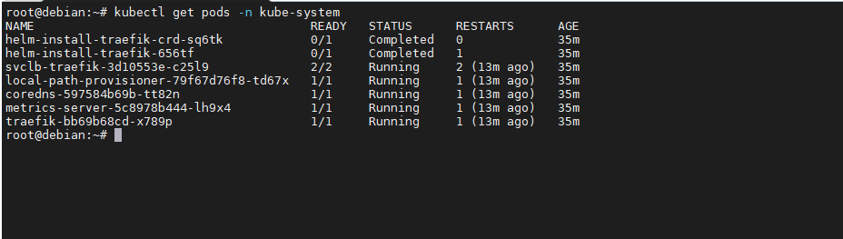

# Задание 1.
Запустите кубернетес локально, используя k3s или minikube на свой выбор. 
Добейтесь стабильной работы всех системных контейнеров.

*В качестве ответа пришлите скриншот результата выполнения команды kubectl get po -n kube-system*  

# Ответ:  

  

# Задание 2.
Есть файл с деплоем:

```
---
apiVersion: apps/v1
kind: Deployment
metadata:
  name: redis
spec:
  selector:
    matchLabels:
      app: redis
  replicas: 1
  template:
    metadata:
      labels:
        app: redis
    spec:
      containers:
      - name: master
        image: bitnami/redis
        env:
         - name: REDIS_PASSWORD
           value: password123
        ports:
        - containerPort: 6379
```  
---
Измените файл так, чтобы:

* redis запускался без пароля;
* создайте Service, который будет направлять трафик на этот Deployment;
* версия образа redis была зафиксирована на 6.0.13.

Запустите Deployment в своем кластере и добейтесь его стабильной работы.

*Приведите ответ в виде получившегося файла.*  

# Ответ:  
1. 
```
---
apiVersion: apps/v1
kind: Deployment
metadata:
  name: redis
spec:
  selector:
    matchLabels:
      app: redis
  replicas: 1
  template:
    metadata:
      labels:
        app: redis
    spec:
      containers:
      - name: master
        image: bitnami/redis
        env:
          - name: ALLOW_EMPTY_PASSWORD
            value: "yes"
        ports:
        - containerPort: 6379
```  
2. 
```
apiVersion: v1
kind: Service
metadata:
  name: redis
spec:
  selector:
    app: redis
  ports:
    - protocol: TCP
      port: 6379
      targetPort: 6379
```  
3. 
```
---
apiVersion: apps/v1
kind: Deployment
metadata:
  name: redis
spec:
  selector:
    matchLabels:
      app: redis
  replicas: 1
  template:
    metadata:
      labels:
        app: redis
    spec:
      containers:
      - name: master
        image: bitnami/redis:6.0.13
        env:
          - name: ALLOW_EMPTY_PASSWORD
            value: "yes"
        ports:
        - containerPort: 6379

```