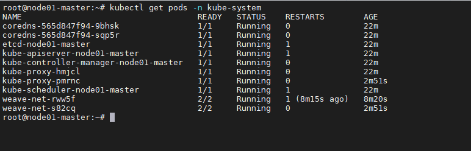
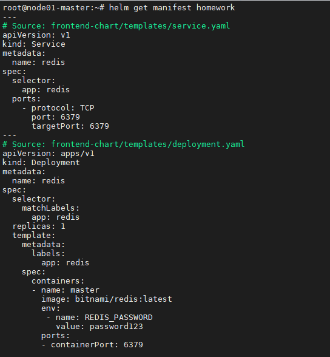

# Задание 1.
1. Создайте свой кластер с помощью kubeadm.
2. Установите любой понравившийся CNI плагин.
3. Добейтесь стабильной работы кластера.  

*В качестве ответа пришлите скриншот результата выполнения команды kubectl get po -n kube-system*

# Ответ:  


---

# Задание 2
Есть файл с деплоем:

```
---
apiVersion: apps/v1
kind: Deployment
metadata:
  name: redis
spec:
  selector:
    matchLabels:
      app: redis
  replicas: 1
  template:
    metadata:
      labels:
        app: redis
    spec:
      containers:
      - name: master
        image: bitnami/redis
        env:
         - name: REDIS_PASSWORD
           value: password123
        ports:
        - containerPort: 6379
```

1. Создайте Helm чарт.
2. Добавьте туда сервис.
3. Вынесите все нужные на Ваш взгляд параметры в values.yaml.
4. Запустите чарт в своем кластере и добейтесь его стабильной работы.

*Приведите вывод команды helm get manifest <имя_релиза> в качестве ответа*

# Ответ:
  


---

# Задание 3
1. Ознакомьтесь с документацией по подключению volume типа hostPath.
2. Дополните деплоймент в чарте подключением этого volume.
3. Запишите что-нибудь в файл на сервере, подключившись к поду с помощью kubectl exec, проверьте правильность подключения volume.

*Приведите ответ в виде получившегося yaml файла.*

# Ответ:
```
---
apiVersion: apps/v1
kind: Deployment
metadata:
  name: {{ .Values.app  }}
spec:
  selector:
    matchLabels:
      app: {{ .Values.app  }}
  replicas: {{ .Values.replicas  }}
  template:
    metadata:
      labels:
        app: {{ .Values.app  }}
    spec:
      securityContext:
        runAsUser: 0
      volumes:
        - name: test-volume
          hostPath:
            path: /var/log
            type: DirectoryOrCreate
      containers:
      - name: master
        image: {{ .Values.repository }}:{{ .Values.tag  }}
        env:
         - name: REDIS_PASSWORD
           value: {{ .Values.REDIS_PASSWORD  }}
        ports:
        - containerPort: {{ .Values.database.port  }}
        volumeMounts:
          - name: test-volume
            mountPath: /log
```
