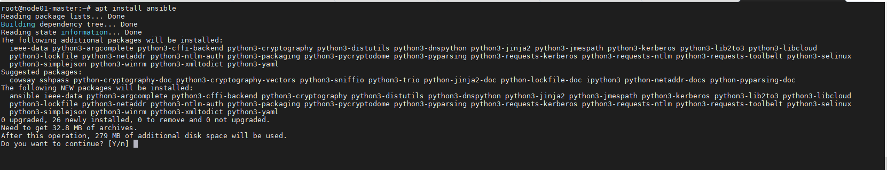
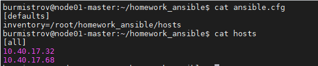
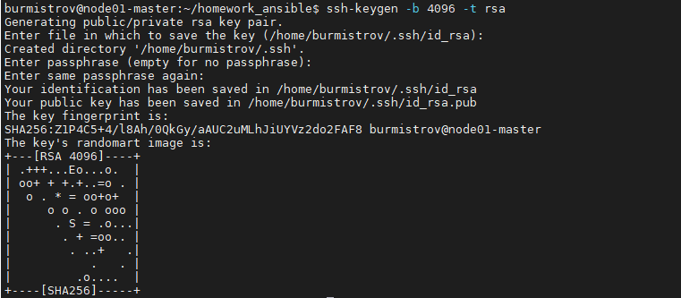
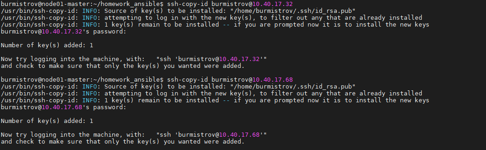
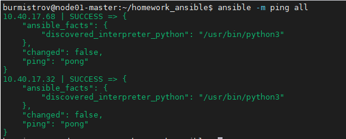

# Задание 1

Какие преимущества дает подход IAC?

*Приведите ответ в свободной форме.*

# Ответ

Отсутствие ручной настройки, скорость "поднятия" инфраструктуры, масштабируемость и воспроизводимость, т.е инфраструктура всегда идентична.  

---

# Задание 2

1. Установите Ansible.
2. Настройте управляемые машины (виртуальные или физические, не менее двух).
3. Создайте файл инвентори. Предлагается использовать файл, размещенный в папке с проектом, а не файл инвентори по умолчанию.
4. Проверьте доступность хостов с помощью модуля ping.

*Приложите скриншоты действий.*  

# Ответ

1.   
2.   
3.   
4.   
5.   

---
