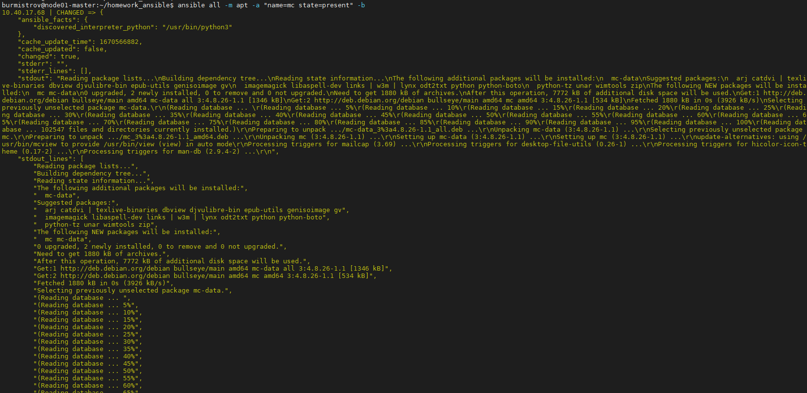
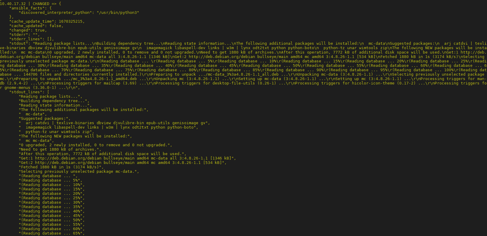
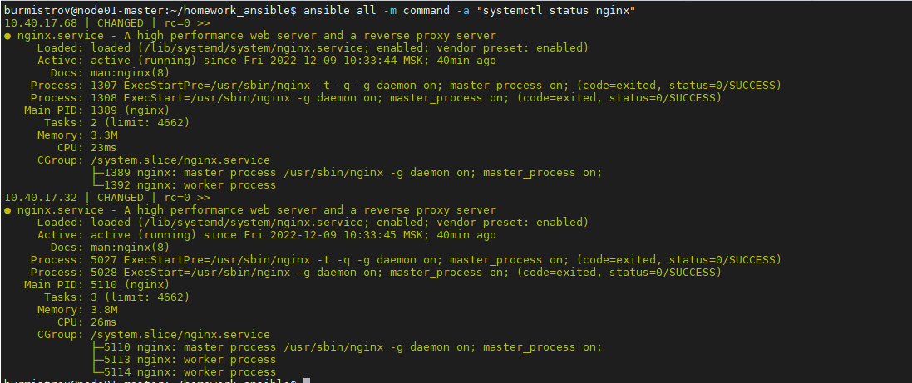
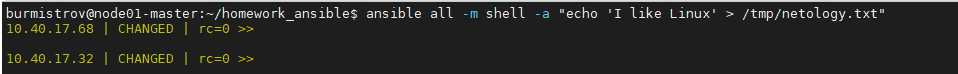

# Задание 1

Какие преимущества дает подход IAC?

*Приведите ответ в свободной форме.*

# Ответ

Отсутствие ручной настройки, скорость "поднятия" инфраструктуры, масштабируемость и воспроизводимость, т.е инфраструктура всегда идентична.  

---

# Задание 2

1. Установите Ansible.
2. Настройте управляемые машины (виртуальные или физические, не менее двух).
3. Создайте файл инвентори. Предлагается использовать файл, размещенный в папке с проектом, а не файл инвентори по умолчанию.
4. Проверьте доступность хостов с помощью модуля ping.

*Приложите скриншоты действий.*  

# Ответ

  
  
  
  
  

---

# Задание 3

Какая разница между параметрами forks и serial?

*Приведите ответ в свободной форме.*  

# Ответ  

**Forks** - максимальное количество одновременных подключений Ansible к каждой задаче.
**Serial** - количество узлов, обрабатываемых в задаче за один запуск.

---

# Задание 4

В этом задании мы будем работать с Ad-hoc коммандами.

1. Установите на управляемых хостах пакет, которого нет(любой).
2. Проверьте статус любого присутствующего на управляемой машине сервиса.
3. Создайте файл с содержимым "I like Linux" по пути /tmp/netology.txt

*Приложите скриншоты запуска команд.*  

# Ответ:  

  
  
  
  