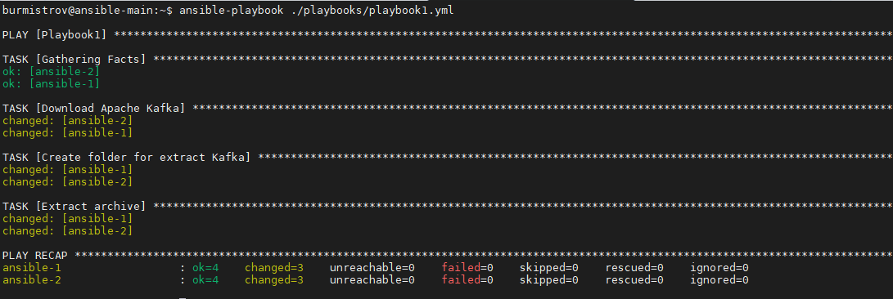

# Задание 1
Напишите 3 playbook'a. При написании рекомендуется использовать текстовый редактор с подсветкой синтаксиса YAML. Плейбуки должны:

1. Скачать какой либо архив, создать папку для распаковки и распаковать скаченный архив. Например, можете использовать официальный сайт и зеркало Apache Kafka https://kafka.apache.org/downloads. При этом можно качать как исходный код, так и бинарные файлы (запакованные в архив), в нашем задании не принципиально.
2. Установить пакет tuned из стандартного репозитория вашей ОС. Запустить его как демон (конфигурационный файл systemd появится автоматически при установке). Добавить tuned в автозагрузку.
3. Изменить приветствие системы (motd) при входе на любое другое по вашему желанию. Пожалуйста, в этом задании используйте переменную для задания приветствия. Переменную можно задавать любым удобным вам способом.

*Приложите файлы с плейбуками и вывод выполнения.*

# Ответ:

1. [playbook1.yml](playbook1.yml)  
  
