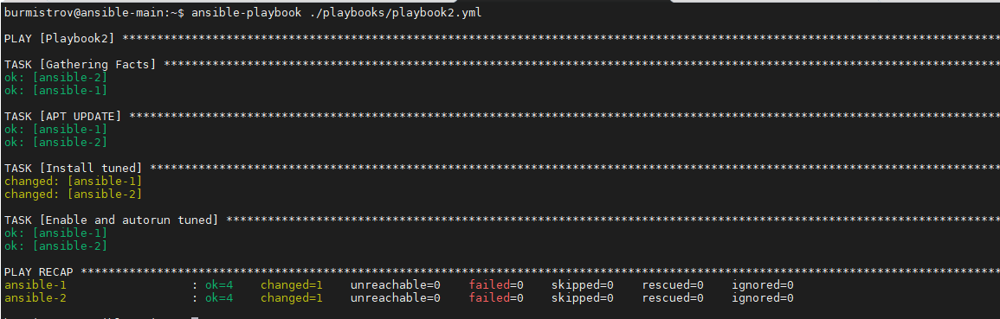
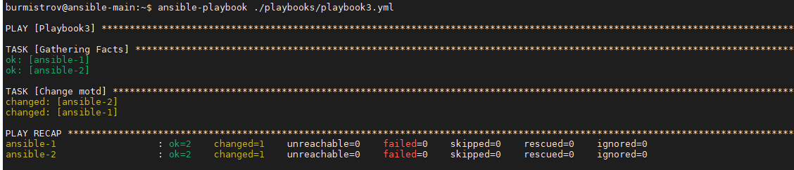
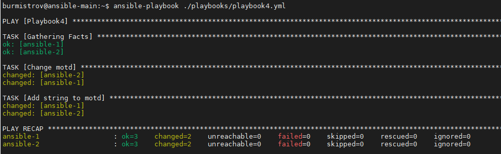
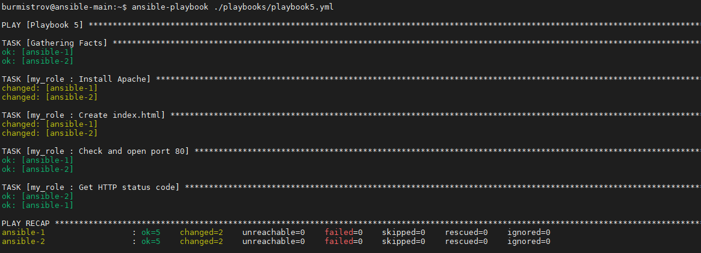
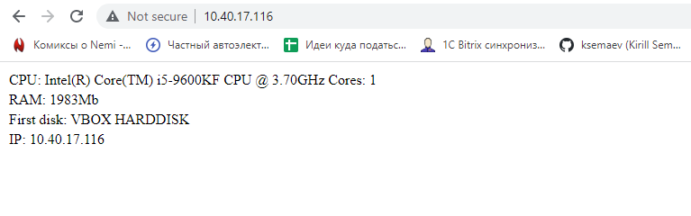
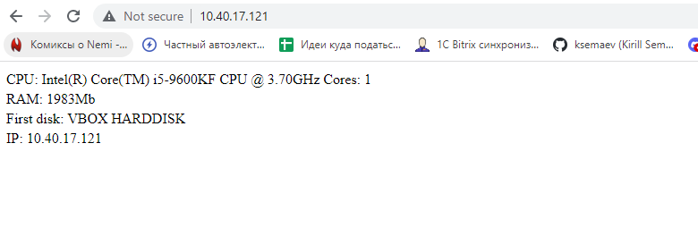

# Задание 5

Напишите 3 playbook'a. При написании рекомендуется использовать текстовый редактор с подсветкой синтаксиса YAML. Плейбуки должны:

1. Скачать какой либо архив, создать папку для распаковки и распаковать скаченный архив. Например, можете использовать официальный сайт и зеркало Apache Kafka <https://kafka.apache.org/downloads>. При этом можно качать как исходный код, так и бинарные файлы (запакованные в архив), в нашем задании не принципиально.
2. Установить пакет tuned из стандартного репозитория вашей ОС. Запустить его как демон (конфигурационный файл systemd появится автоматически при установке). Добавить tuned в автозагрузку.
3. Изменить приветствие системы (motd) при входе на любое другое по вашему желанию. Пожалуйста, в этом задании используйте переменную для задания приветствия. Переменную можно задавать любым удобным вам способом.

*Приложите файлы с плейбуками и вывод выполнения.*

# Ответ

1. [playbook1.yml](playbook1.yml)  

  

2. [playbook2.yml](playbook2.yml)

  

3. [playbook3.yml](playbook3.yml)

---

# Задание 6

Задание модифицировать playbook из 3 пункта 1 задания:  

Playbook должен в качестве приветствия установить ip адрес и hostname усправляемого хоста, пожелание хорошего дня системному администратору.  

*Приложите файл с модифицированным плейбуком и вывод выполнения.*  

# Ответ  

[playbook4.yml](playbook4.yml)  

---

# Задание 7

Создайте playbook, который будет включать в себя одну, вами созданную роль. Роль должна:

1. Установить веб сервер Apache на управляемые хосты.
2. Сконфигурировать файл index.html c выводом характеристик для каждого компьютера. Необходимо включить CPU, RAM, величину первого HDD, ip адрес.
3. Открыть порт 80 (если необходимо), запустить сервер и добавить его в автозагрузку.
4. Сделать проверку доступности веб сайта(ответ 200).

*Приложите архив с ролью и вывод выполнения.*  

# Ответ  

[playbook](playbook5.yml)

[Archive role](my_role.zip)

  

  

