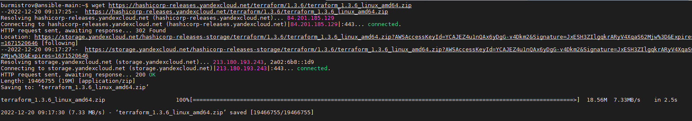
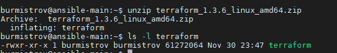
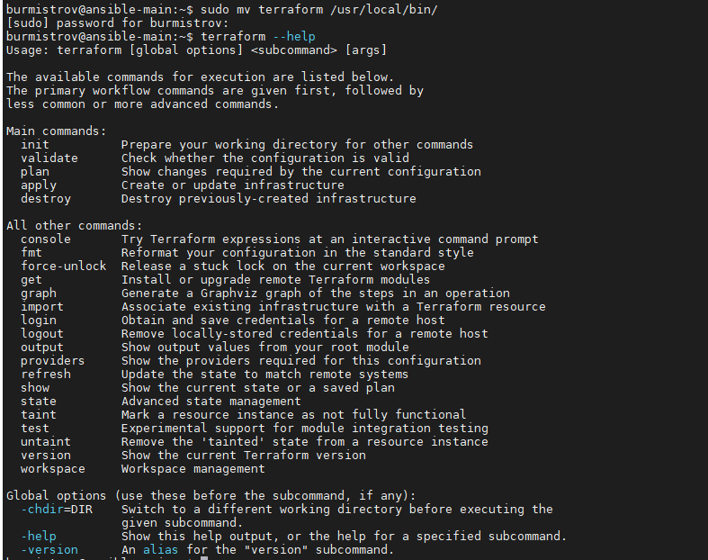

## Задание 1

Опишите виды подхода к IaC:

1. Функциональный
2. Процедурный
3. Интеллектуальный

*Приведите ответ в свободной форме.*

## Ответ  

1. Декларативный - нацелен на то, чтобы описать, как должна выглядеть конфигурация.
2. Процедурный - описывает, какие изменения необходимо внести.
3. Интеллектуальный - описывает, почему инфраструктура должна так выглядеть.

---

## Задание 2

Как вы считаете, в чем преимущество применения terraform?

*Приведите ответ в свободной форме.*  

## Ответ

1. Портативность
2. Простота запуска приложений

---

## Задание 3

Какие минусы можно выделить при использование IaC?

*Приведите ответ в свободной форме.*  

## Ответ

Основные минусы:

1. Необходимо максимальное покрытие тестами, т.к любая ошибка может распространиться на все окружения проекта  
2. Любые измения должны выполняться только через спец. инструменты, никакого ручного конфигурирования.  

---

## Задание 4

Установите Terraform на компьютерную систему (виртуальную или хостовую) используя лекцию или
<https://learn.hashicorp.com/tutorials/terraform/install-cli>

*Приложите скриншоты запуска команд.*  

## Ответ  

  

  

---

## Задание 5

Перечислите основные функции, которые могут использоваться в terraform.  
*Приведите ответ в свободной форме*  

## Ответ  

1. Числовые функции (abs, ceil, floor и т.д)
2. Строковые функции (chomp, format, formatlist и т.д)  
3. Функции по работе с коллекциями (chunklist, coalesce ...)  
4. Функции кодирования (base64encode, base64gzip, base64decode ...)  
5. Функции для работы с файловой системой (dirname, pathexpand, basename ...)  
6. Функции по работе с датой и временем (formatdate, timeadd ...)  
7. Функции по работе с IP сетями (cidrhost, cidrnetmask ...)  
