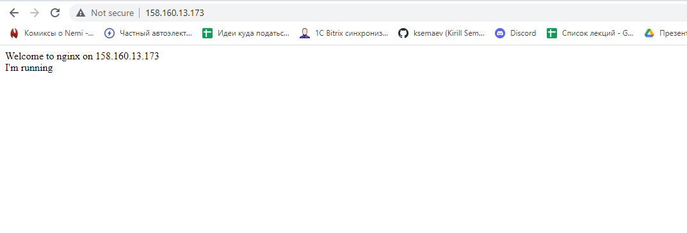
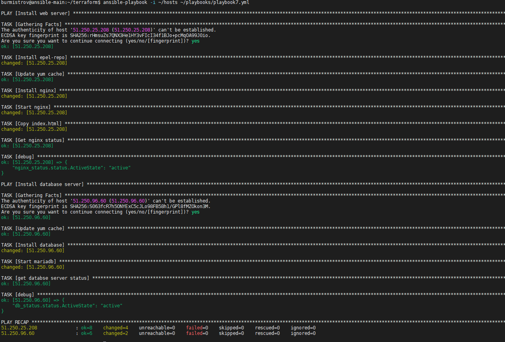

## Задание 1

**Выполните действия, приложите скриншот скриптов, скриншот выполненного проекта.**

От заказчика получено задание: при помощи Terraform и Ansible собрать виртуальную инфраструктуру и развернуть на ней веб-ресурс.

В инфраструктуре нужна одна машина с ПО ОС Linux, двумя ядрами и двумя гигабайтами оперативной памяти.

Требуется установить nginx, залить при помощи Ansible конфигурационные файлы nginx и веб-ресурса.

Для выполнения этого задания нужно сгенирировать SSH-ключ командой ssh-kengen. Добавить в конфигурацию Terraform ключ в поле:

```
 metadata = {
    user-data = "${file("./meta.txt")}"
  }
```

В файле meta прописать:

```
 users:
  - name: user
    groups: sudo
    shell: /bin/bash
    sudo: ['ALL=(ALL) NOPASSWD:ALL']
    ssh-authorized-keys:
      - ssh-rsa  xxx
```

Где xxx — это ключ из файла /home/"name_ user"/.ssh/id_rsa.pub. Примерная конфигурация Terraform:

```
terraform {
  required_providers {
    yandex = {
      source = "yandex-cloud/yandex"
    }
  }
}

provider "yandex" {
  token     = "xxx"
  cloud_id  = "xxx"
  folder_id = "xxx"
  zone      = "ru-central1-a"
}

resource "yandex_compute_instance" "vm-1" {
  name = "terraform1"

  resources {
    cores  = 2
    memory = 2
  }

  boot_disk {
    initialize_params {
      image_id = "fd87kbts7j40q5b9rpjr"
    }
  }

  network_interface {
    subnet_id = yandex_vpc_subnet.subnet-1.id
    nat       = true
  }
  
  metadata = {
    user-data = "${file("./meta.txt")}"
  }

}
resource "yandex_vpc_network" "network-1" {
  name = "network1"
}

resource "yandex_vpc_subnet" "subnet-1" {
  name           = "subnet1"
  zone           = "ru-central1-b"
  network_id     = yandex_vpc_network.network-1.id
  v4_cidr_blocks = ["192.168.10.0/24"]
}

output "internal_ip_address_vm_1" {
  value = yandex_compute_instance.vm-1.network_interface.0.ip_address
}
output "external_ip_address_vm_1" {
  value = yandex_compute_instance.vm-1.network_interface.0.nat_ip_address
}
```

В конфигурации Ansible указать:

* внешний IP-адрес машины, полученный из output external_ip_address_ vm_1, в файле hosts;
* доступ в файле plabook *yml поля hosts.

```
- hosts: 138.68.85.196
  remote_user: user
  tasks:
    - service:
        name: nginx
        state: started
      become: yes
      become_method: sudo
```

Провести тестирование.

---

## Ответ

[main.tf](1/main.tf)  
[playbook.yml](1/playbook.yml)  
[template](1/index.html.j2)  
[hosts](1/hosts)  



---

## Задание 2*

**Выполните действия, приложите скриншот скриптов, скриншот выполненного проекта.**

1. Перестроить инфраструктуру и добавить в неё вторую виртуальную машину.
2. Установить на вторую виртуальную машину базу данных.
3. Выполнить проверку состояния запущенных служб через Ansible.

## Ответ

[main.tf](2/main.tf)  
[playbook.yml](2/playbook.yml)  
[template](2/index.html.j2)  
[hosts](2/hosts)  

