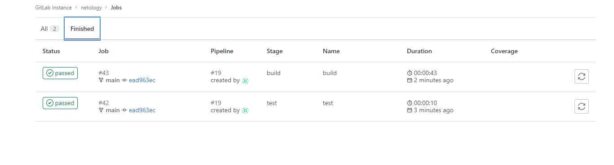
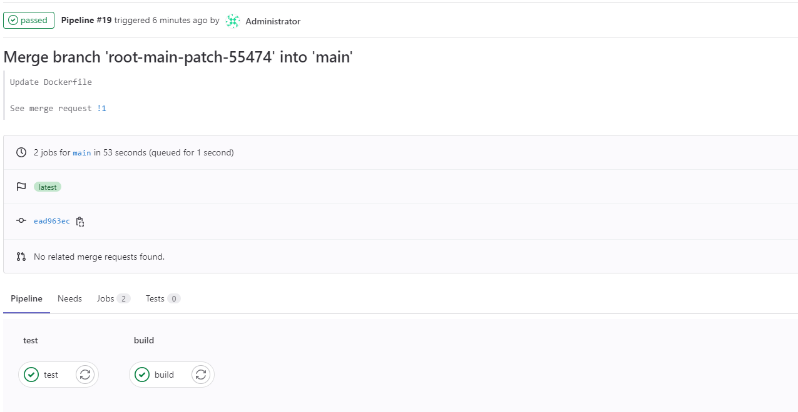

### Задание 1

**Что нужно сделать:**

1. Разверните GitLab локально, используя Vagrantfile и инструкцию, описанные в этом репозитории.
2. Создайте новый проект и пустой репозиторий в нём.
3. Зарегистрируйте gitlab-runner для этого проекта и запустите его в режиме Docker. Раннер можно регистрировать и запускать на той же виртуальной машине,  на которой запущен GitLab.

*В качестве ответа в репозиторий шаблона с решением добавьте скриншоты с настройками раннера в проекте.*  

### Ответ

  

---

### Задание 2  

**Что нужно сделать:**

1. Запушьте репозиторий на GitLab, изменив origin. Это изучалось на занятии по Git.
2. Создайте .gitlab-ci.yml, описав в нём все необходимые, на ваш взгляд, этапы.

В качестве ответа в шаблон с решением добавьте:

* файл gitlab-ci.yml для своего проекта или вставьте код в соответствующее поле в шаблоне;
* скриншоты с успешно собранными сборками.  

### Ответ

[gitlab-ci.yml](gitlab-ci.yml)  
  


---

### Задание 3*

Измените CI так, чтобы:  

* этап сборки запускался сразу, не дожидаясь результатов тестов;
* тесты запускались только при изменении файлов с расширением *.go.  

*В качестве ответа добавьте в шаблон с решением файл gitlab-ci.yml своего проекта или вставьте код в соответсвующее поле в шаблоне.*  

### Ответ

```
stages:
  - test
  - build

test:
  stage: test
  image: golang:1.16
  script:
    - /usr/local/go/bin/go test .
    
build:
  stage: build
  image: docker:latest
  script:
   - docker build .
  needs: []
  ```
