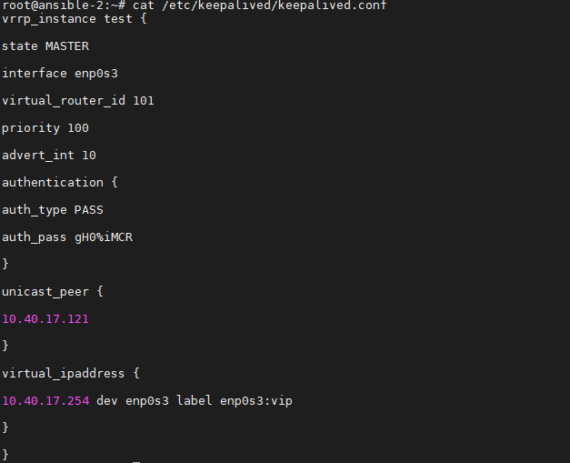
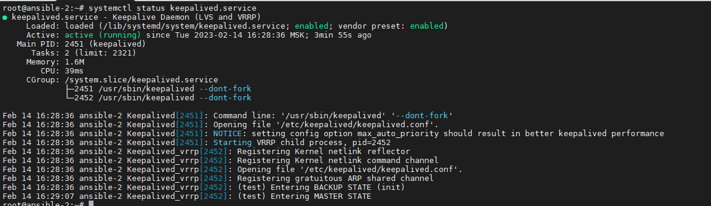
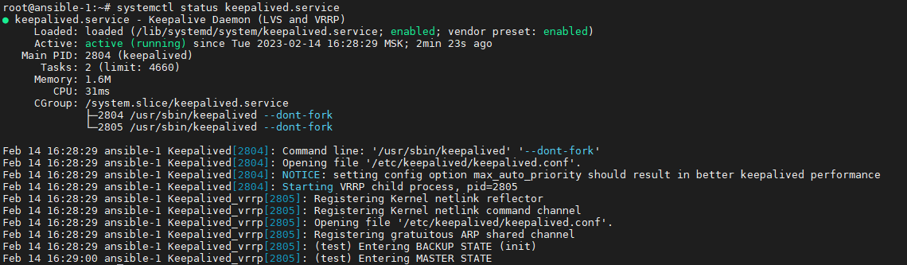
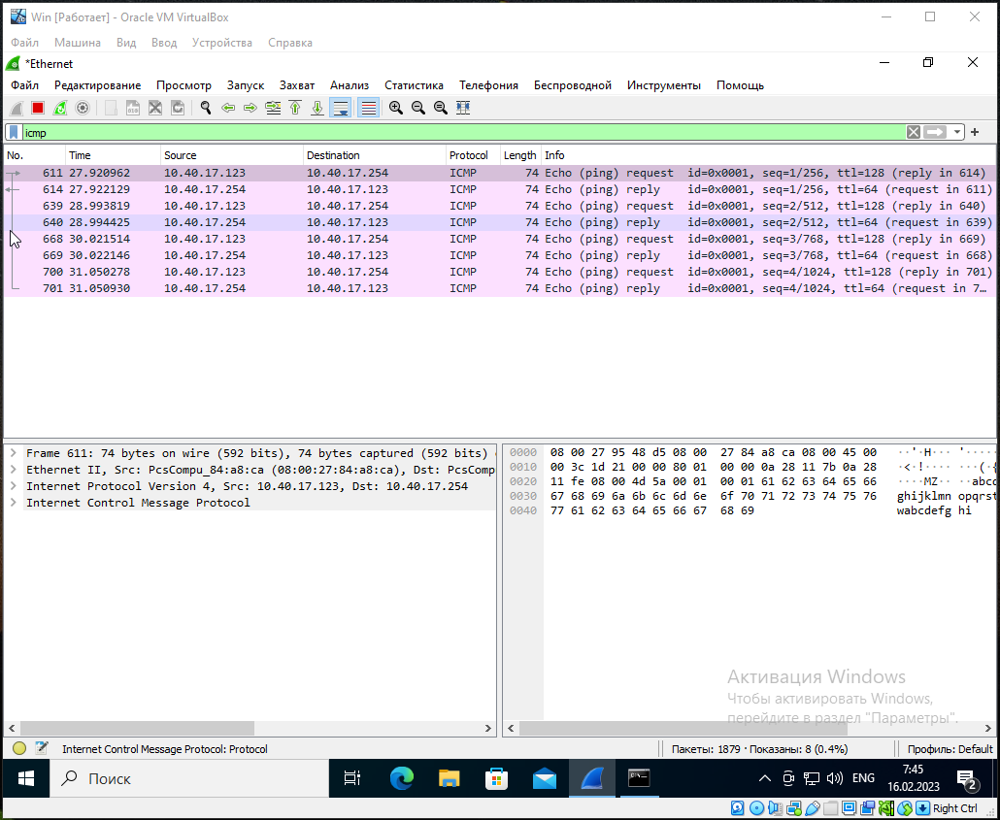
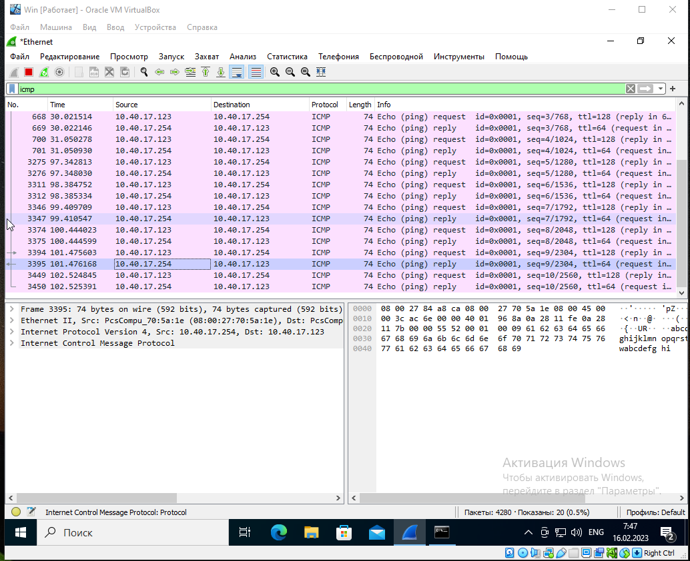

### Задание 1

Разверните топологию из лекции и выполните установку и настройку сервиса Keepalived.

```
vrrp_instance test {

state "name_mode"

interface "name_interface"

virtual_router_id "number id"

priority "number priority"

advert_int "number advert"

authentication {

auth_type "auth type"

auth_pass "password"

}

unicast_peer {

"ip address host"

}

virtual_ipaddress {

"ip address host" dev "interface" label "interface":vip

}

}
```

*Пришлите скриншот рабочей конфигурации и состояния сервиса для каждого нода.*  

### Ответ:  

  

  

  

---

### Задание 2*

Проведите тестирование работы ноды, когда один из интерфейсов выключен. Для этого:

* добавьте ещё одну виртуальную машину и включите её в сеть;
* на машине установите Wireshark и запустите процесс прослеживания интерфейса;
* запустите процесс ping на виртуальный хост;
* выключите интерфейс на одной ноде (мастер), остановите Wireshark;
* найдите пакеты ICMP, в которых будет отображён процесс изменения MAC-адреса одной ноды на другой.

*Пришлите скриншот до и после выключения интерфейса из Wireshark.*  

### Ответ:  

  
  