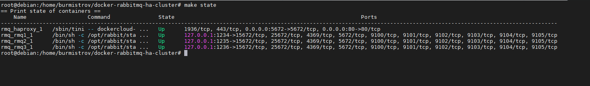
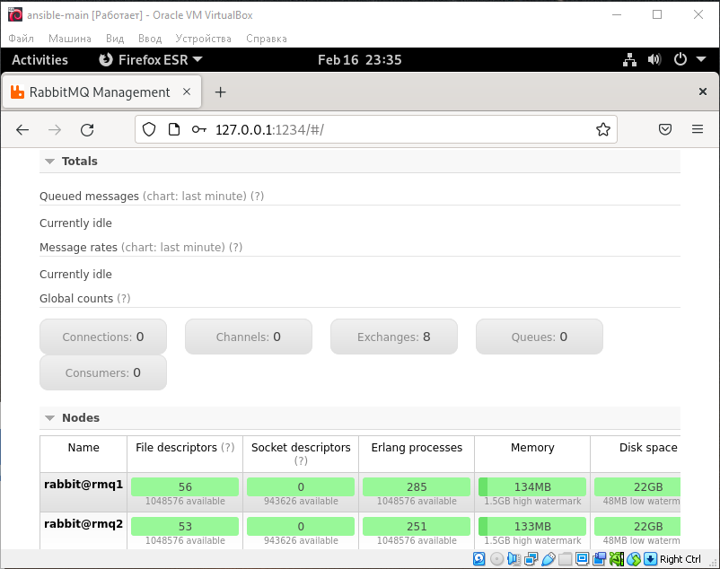
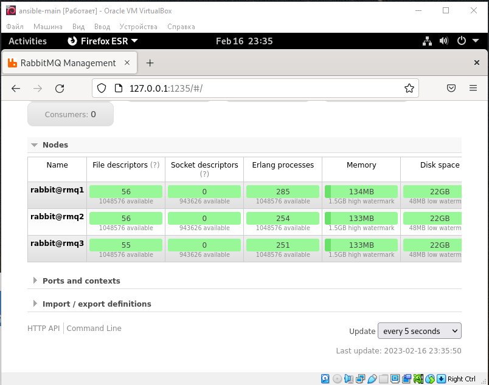
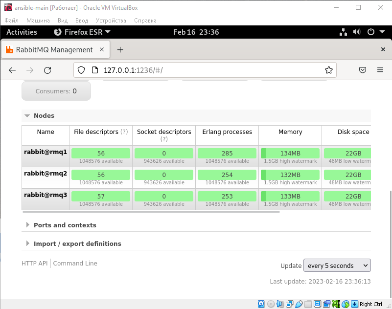

### Задание 1  

В чём различие между SMP- и MPP-системами?

*Приведите ответ в свободной форме.*  

### Ответ:  
SMP (cимметричные мультипроцессоры) - сильно связанная система  
MPP (системы с массовым параллелизмом) - слабо связанная система

---  

### Задание 2  

В чём отличие сильно связанных и слабо связанных систем?

*Приведите ответ в свободной форме.*  

### Ответ:  

Сильно связанная система состоит из нескольких однородных процессоров и массива общей памяти.  
В слабо связанных системах вся память распределена между процессорами  

---

### Задание 3  

Какие преимущества отличают кластерные системы от обычных серверов?

*Приведите ответ в свободной форме.*  

### Ответ:  

 * масштабируемость
 * нет ограничений на размер узлов и кластеров
 * наращиваемая масштабируемость (можно расширять узлы по необходимости)
 * высокий коэффициент готовности
 * отказоустойчивость
 * соотношение цена/производительность
 * можно строить кластер из любых строительных блоков (чем проще и стандартнее блоки, тем дешевле)  

---

### Задание 4

Приведите примеры типов современных кластерных систем.

*Приведите ответ в свободной форме.*  

### Ответ:  

* отказоустойчивые кластеры  
* кластеры с балансировкой нагрузки  
* вычислительные кластеры  
* системы распределенных вычислений.  

---

### Задание 5

Где используют сервис Kafka, rabitMQ?

*Приведите ответ в свободной форме.*  

### Ответ:  

Сервисы Kafka и RabbitMQ используются в системах распределенных вычислений.  

---

### Задание 6  

Исследуйте построение кластера на основе rabbitMQ: https://github.com/ypereirareis/docker-rabbitmq-ha-cluster. Используя docker-compose, соберите инфраструктуру. Исследуйте её работы.

Ответьте на вопросы.

* На каких компонетах развёрнут кластер?
* Назначение компонентов кластера.
* Какие тесты можно провести для анализа работы кластера?

*Приведите в пример скриншоты работающей системы и ответы на вопросы.*  

### Ответ:  

* Компоненты кластера: HAProxy, docker, RabbitMQ
* HAProxy - используется для балансировки нагрузки и обеспечении отказоустойчивости. Docker - сети и ноды кластера. RabbitMQ - кластеризованное приложение
* Тесты: проверка работы балансировщика, иммитация сбоя узла, сетевой раздел, постоянство сообщений, сообщения NO ACK и повторные попытки

  

  

  

  

