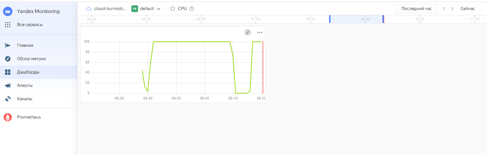

### Задание 1

Создайте виртуальную машину в Yandex Cloud Compute Cloud и с помощью Yandex Monitoring создайте дашборд, на котором будет видно загрузку процессора.

*Приложите скриншот.*

### Ответ:  

  

---

### Задание 2*

С помощью Yandex Monitoring сделайте 2 алерта на загрузку процессора: WARN и ALARM. Создайте уведомление по e-mail.

### Ответ:  

