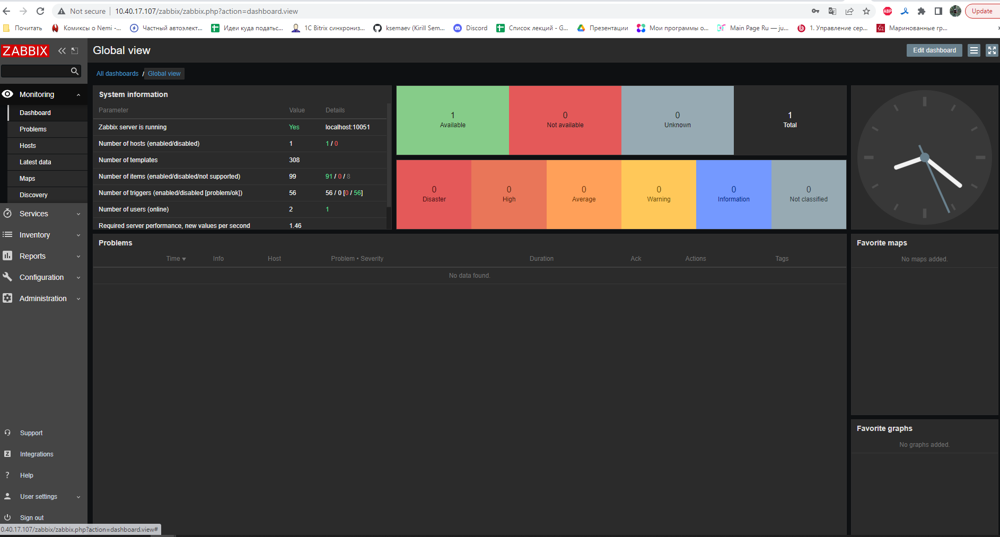
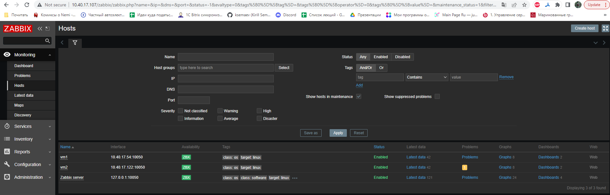
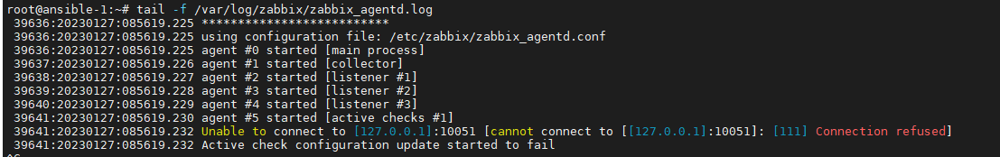
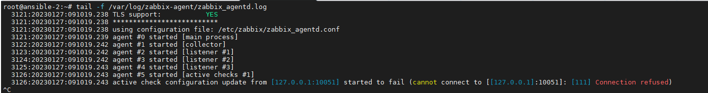
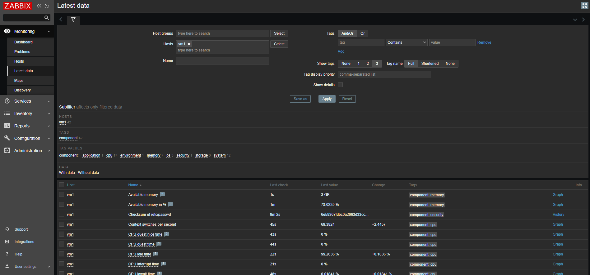
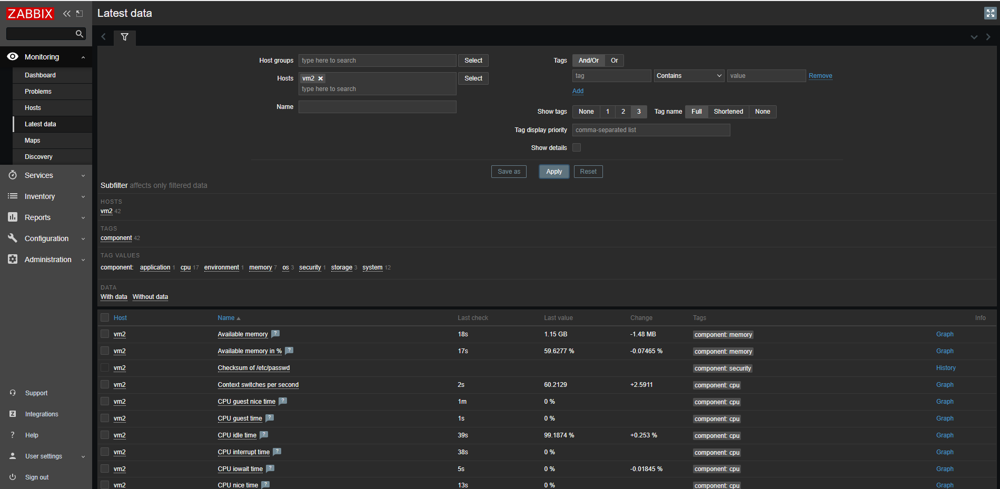
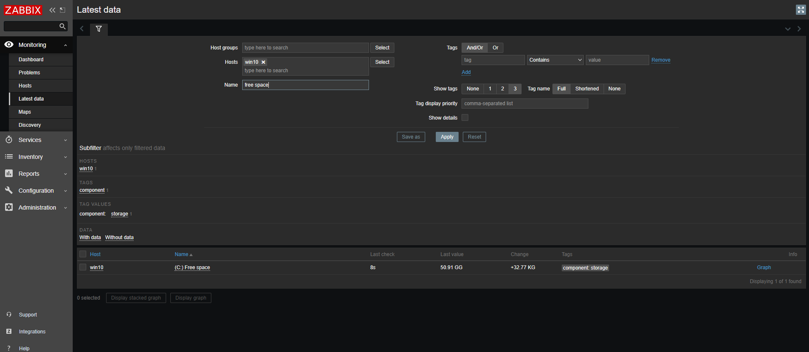

### Задание 1  

Установите Zabbix Server с веб-интерфейсом.

*Приложите скриншот авторизации в админке. Приложите текст использованных команд в GitHub.*  

### Ответ:  
  

```
wget https://repo.zabbix.com/zabbix/6.0/debian/pool/main/z/zabbix-release/zabbix-release_6.0-4%2Bdebian11_all.deb
dpkg -i zabbix-release_6.0-4+debian11_all.deb
apt update
apt install zabbix-server-pgsql zabbix-frontend-php php7.4-pgsql zabbix-apache-conf zabbix-sql-scripts zabbix-agent
apt install postgresql
sudo -u postgres createuser --pwprompt zabbix
sudo -u postgres createdb -O zabbix zabbix
zcat /usr/share/zabbix-sql-scripts/postgresql/server.sql.gz | sudo -u zabbix psql zabbix
vim /etc/zabbix/zabbix_server.conf (строка DBPassword)
systemctl restart zabbix-server zabbix-agent apache2
systemctl enable zabbix-server zabbix-agent apache2
```  

---

### Задание 2  

Установите Zabbix Agent на два хоста.

*Приложите скриншот раздела Configuration > Hosts, где видно, что агенты подключены к серверу. Приложите скриншот лога zabbix agent, где видно, что он работает с сервером. Приложите скриншот раздела Monitoring > Latest data для обоих хостов, где видны поступающие от агентов данные. Приложите текст использованных команд в GitHub.*  

### Ответ:  

  
  
  
  
  

```
apt install zabbix-agent
sed -i 's/Server=127.0.0.1/Server=10.40.17.107'/g' /etc/zabbix/zabbix_server.conf
systemctl start zabbix-agent
systemctl enable zabbix-agent
```  

---  

### Задание 3*  

Установите Zabbix Agent на Windows (компьютер) и подключите его к серверу Zabbix.

*Приложите скриншот раздела Latest Data, где видно свободное место на диске C:*  

# Ответ:  

  