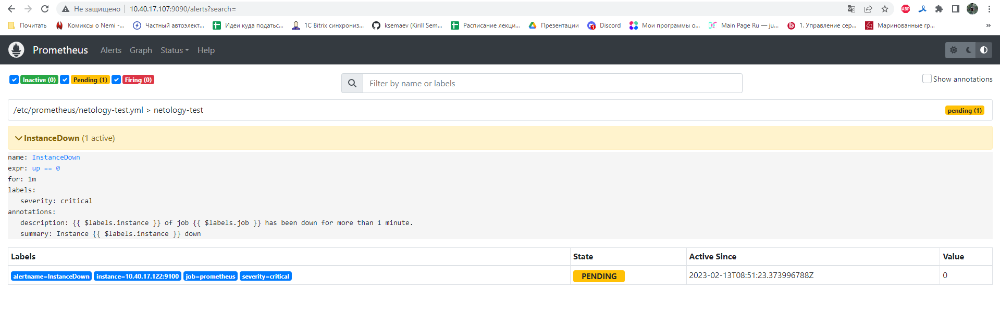
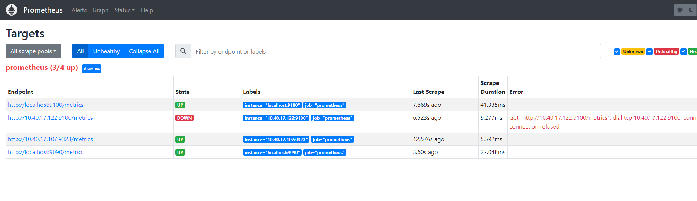

### Задание 1

Создайте файл с правилом оповещения, как в лекции, и добавьте его в конфиг Prometheus.

*Погасите node exporter, стоящий на мониторинге, и прикрепите скриншот раздела оповещений Prometheus, где оповещение будет в статусе Pending.*

### Ответ:

  

---

### Задание 2

Установите Alertmanager и интегрируйте его с Prometheus.

*Прикрепите скриншот Alerts из Prometheus, где правило оповещения будет в статусе Fireing, и скриншот из Alertmanager, где будет видно действующее правило оповещения.*

### Ответ:  

  
  

---

### Задание 3

Активируйте экспортёр метрик в Docker и подключите его к Prometheus.

*Приложите скриншот браузера с открытым эндпоинтом, а также скриншот списка таргетов из интерфейса Prometheus.*  

### Ответ:  

 
 

---

### Задание 4*

Создайте свой дашборд Grafana с различными метриками Docker и сервера, на котором он стоит.

*Приложите скриншот, на котором будет дашборд Grafana с действующей метрикой.*  

### Ответ:

