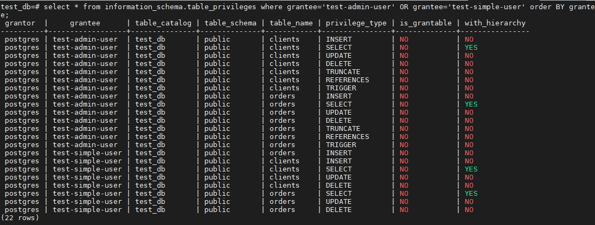

## Задача 1  

Используя Docker, поднимите инстанс PostgreSQL (версию 12) c 2 volume, в который будут складываться данные БД и бэкапы.  

Приведите получившуюся команду или docker-compose-манифест.  

## Ответ:  

```
version: "3.3"
services:
  postgres:
    image: postgres:12
    environment:
      POSTGRES_PASSWORD: "netology"
    ports:
      - "5432:5432"
    volumes:
      - ./pg_data:/var/lib/postgresql/data
      - ./backups:/backups
```  

---  

## Задача 2

В БД из задачи 1: 

- создайте пользователя test-admin-user и БД test_db;
- в БД test_db создайте таблицу orders и clients (спeцификация таблиц ниже);
- предоставьте привилегии на все операции пользователю test-admin-user на таблицы БД test_db;
- создайте пользователя test-simple-user;
- предоставьте пользователю test-simple-user права на SELECT/INSERT/UPDATE/DELETE этих таблиц БД test_db.

Таблица orders:

- id (serial primary key);
- наименование (string);
- цена (integer).

Таблица clients:

- id (serial primary key);
- фамилия (string);
- страна проживания (string, index);
- заказ (foreign key orders).

Приведите:

- итоговый список БД после выполнения пунктов выше;
- описание таблиц (describe);
- SQL-запрос для выдачи списка пользователей с правами над таблицами test_db;
- список пользователей с правами над таблицами test_db.  

## Ответ:  

  

  

``` select * from information_schema.table_privileges where grantee='test-admin-user' OR grantee='test-simple-user' order BY grantee;```  

  

---  

## Задача 3

Используя SQL-синтаксис, наполните таблицы следующими тестовыми данными:

Таблица orders

|Наименование|цена|
|------------|----|
|Шоколад| 10 |
|Принтер| 3000 |
|Книга| 500 |
|Монитор| 7000|
|Гитара| 4000|

Таблица clients

|ФИО|Страна проживания|
|------------|----|
|Иванов Иван Иванович| USA |
|Петров Петр Петрович| Canada |
|Иоганн Себастьян Бах| Japan |
|Ронни Джеймс Дио| Russia|
|Ritchie Blackmore| Russia|

Используя SQL-синтаксис:
- вычислите количество записей для каждой таблицы.

Приведите в ответе:

    - запросы,
    - результаты их выполнения.  

## Ответ:  

```select count(*) from clients;```  

```select count(*) from clients;```  

  

---  

## Задача 4

Часть пользователей из таблицы clients решили оформить заказы из таблицы orders.

Используя foreign keys, свяжите записи из таблиц, согласно таблице:

|ФИО|Заказ|
|------------|----|
|Иванов Иван Иванович| Книга |
|Петров Петр Петрович| Монитор |
|Иоганн Себастьян Бах| Гитара |

Приведите SQL-запросы для выполнения этих операций.

Приведите SQL-запрос для выдачи всех пользователей, которые совершили заказ, а также вывод этого запроса.
 
Подсказка: используйте директиву `UPDATE`.  

## Ответ:  

  

  

  

---  

## Задача 5

Получите полную информацию по выполнению запроса выдачи всех пользователей из задачи 4 
(используя директиву EXPLAIN).

Приведите получившийся результат и объясните, что значат полученные значения.  

## Ответ:  

  

Seq Scan — означает, что используется последовательное, блок за блоком, чтение данных таблицы clients
Cost - некая виртуальная величина призванная оценить затратность операции. Первое значение 0.00 — затраты на получение первой строки. Второе — 18.10 — затраты на получение всех строк.
Единица измерения cost – «извлечение одной страницы в последовательном (sequential) порядке». То есть оценивается и время, и использование ресурсов.  

rows — приблизительное количество возвращаемых строк при выполнении операции Seq Scan. Это значение возвращает планировщик.  

width - это оценка PostgreSQL того, сколько, в среднем, байт содержится в одной строке, возвращенной в рамках данной операции 

---  

## Задача 6

Создайте бэкап БД test_db и поместите его в volume, предназначенный для бэкапов (см. задачу 1).

Остановите контейнер с PostgreSQL, но не удаляйте volumes.

Поднимите новый пустой контейнер с PostgreSQL.

Восстановите БД test_db в новом контейнере.

Приведите список операций, который вы применяли для бэкапа данных и восстановления.  

## Ответ:  

   

  

  

 

  


